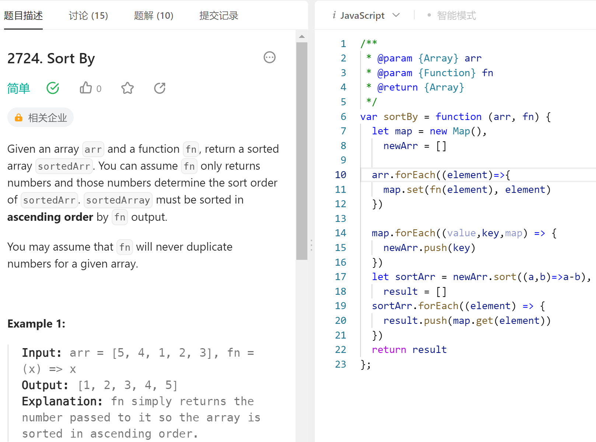
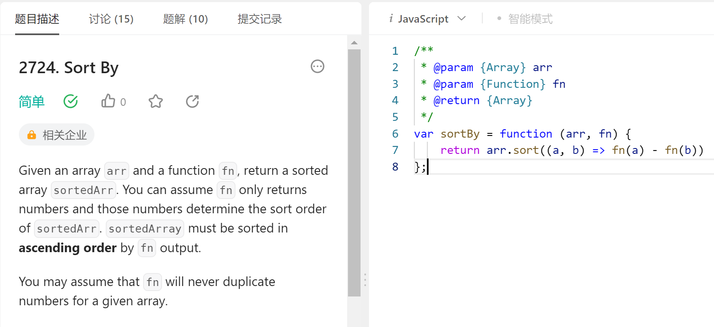

- DONE [#A] 力扣刷题 sort（）要是比较数字，必须加上比较函数！！！第一次体会到TS的意义
  :LOGBOOK:
  CLOCK: [2023-08-19 Sat 12:52:42]--[2023-08-19 Sat 19:03:49] =>  06:11:07
  :END:
- DONE  [#B] Flutter开发 看了JS与dart的对比，dart可以简单理解为结合和java的结合，对比react native.js来说代码要规范些，开发也相对比较简单和容易理解。
- DONE [#B] 学习rust  rust学习成本较高，可用于side-project，但对找工作的帮助不大。
- DONE  整理书签readwise reader
-
- 箭头函数加上花括号需要写return，不加花括号不需要写，默认就有return。
- 以后刷题不宜在一题上花过一小时，应适时放手看题解，不然会把专注力消耗完
- ```
  [...datas.values()].sort((a,b) => a.id - b.id);
  ```
- 上面这一句...将（map的value）迭代器解构，然后放到一个新的数组进行重新排序，太牛了
- 递归真的抽象......
-
- 下一阶段：了解递归和函数式编程，以及时间复杂度
- 
- 
-