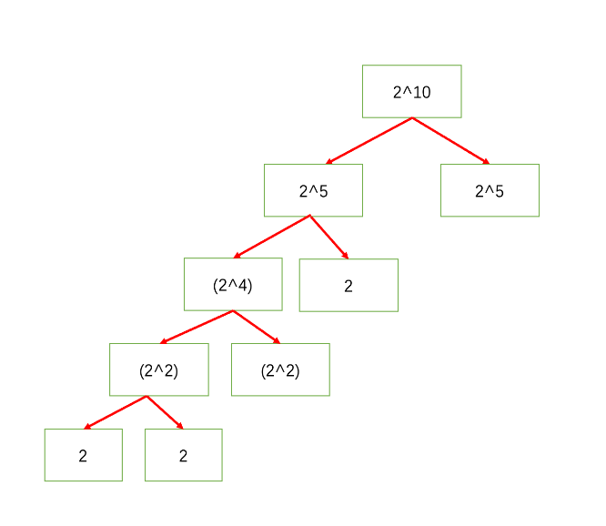

- 1 0 1 0 1 0 0 0
- 0 0 0 0 1 0 1 1
-
- 1 0 1 0 0 0 1 1 （a）
-
- 0 0 0 0 1 0 0 0
- 0 0 0 1 0 0 0 0 （carry）(b)
-
- 1 0 1 1 0 0 1 1
- 128 32 16 2 1
- 160 19
- 179
-
- 64 16 8 4 2
- 64 16  4 1
- 128 32 12 5 2
- 160 19
- 179
-
- 1011
- 1010
- 1010
- 1001
- 1000
- 0111
- 0000
-
- 数值的整数次方
- 先考虑次方为正数的情况
- 2的3次方 左移2位
- 0010 -> 1000
- 左移?
- 3的3次方呢 27 左移2位
- 0000 0011 -> 0001 1011
- 4的4次方呢 256 左移6位
- 0000 0100 -> 1 0000 0000
- 有什么规律
- 16的二次方呢 256 左移了4位
- 0001 0000 -> 1 0000 0000
- 64的二次方呢 4096
- 0100 0000 ->  1 0000 0000 0000
- 规律：左移 最高位的位数 * 次方数-1
-
- 如果次方数是负数呢？
- 2的-1次方
- 0.5怎么表示
- 0.1
- 3.4
- 0.4 * 2 = 0.8  -- 0
- 0.8 * 2 = 1.6 -- 1
- 0.6 *2 = 1.2 -- 1
- 0.2 * 2 = 0.4 -- 0
- 101.01100110....
-
- 0001
- 1111
- 0001
- 0111
- 0001
- 2的8次方
- x：2 4
- y: 8 4
- res:2
-
-
-
- 7的10次方 10：1010 0101 0010 0001
- exp 10 5 2
- base 7 49 49*49
- ans 49 49*49*49*49 7的8次方
- 