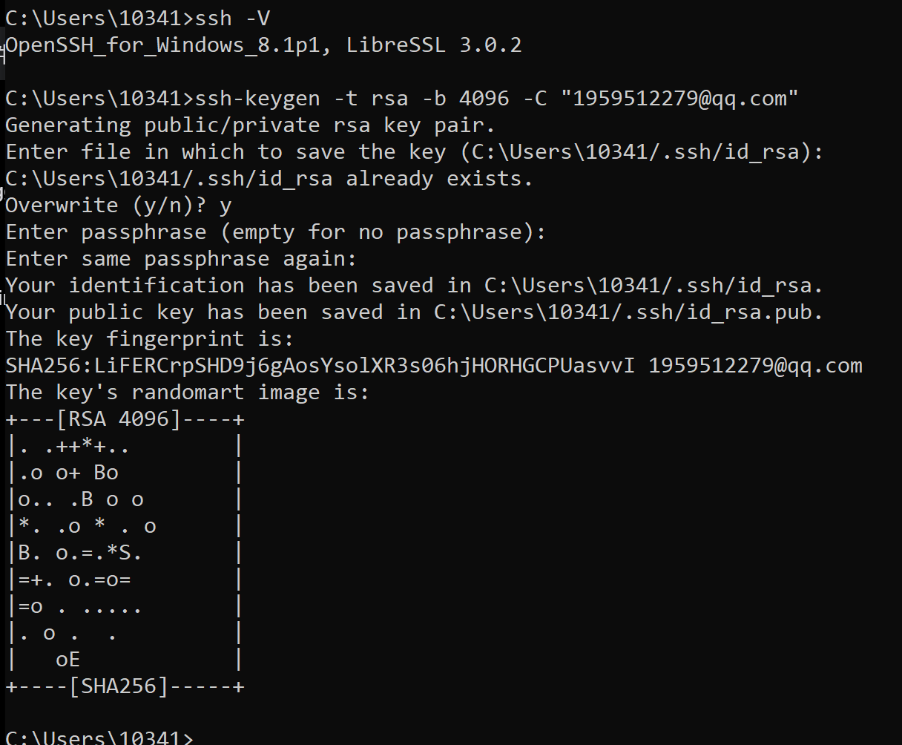

- 待处理的问题：
	- DONE 生产环境中前端调用api不能用localhost
	- DONE 首页渲染的时候分页组建有异常抖动，且第一次加载博客列表时很慢，
	  :LOGBOOK:
	  CLOCK: [2023-12-13 Wed 15:55:57]--[2023-12-13 Wed 15:55:57] =>  00:00:00
	  :END:
		- 解决方案 添加了一个loading
	- TODO 能否使用webpack等方法不打包post文件夹中的数据。
	- TODO 如何搭建一个图床用于存放自己的图片。
	- TODO 很多地方没有遵循ts的规范，后面要补上
	- TODO 点击博客进入详情页，返回的时候不能返回到当前页，应该需要添加路由管理来解决
- 
-
-