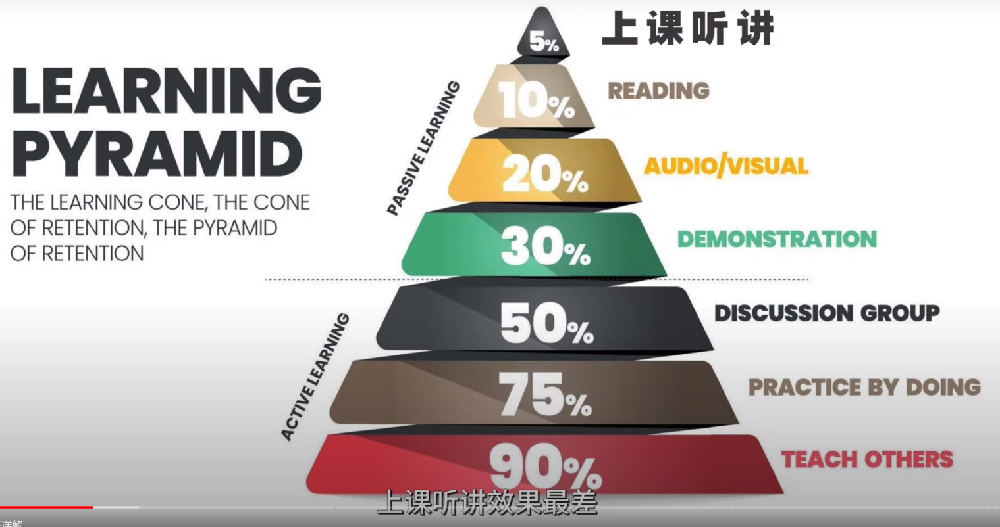
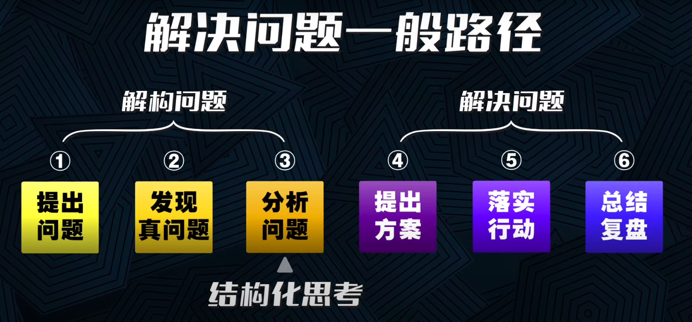

- DOING [[react面试题]]
  SCHEDULED: <2023-12-15 Fri>
  :LOGBOOK:
  CLOCK: [2023-12-14 Thu 18:25:23]--[2023-12-14 Thu 18:25:24] =>  00:00:01
  CLOCK: [2023-12-14 Thu 18:25:24]--[2023-12-14 Thu 18:25:25] =>  00:00:01
  CLOCK: [2023-12-15 Fri 09:34:19]
  :END:
- TODO 机器学习实验三实验报告
  SCHEDULED: <2023-12-15 Fri>
- TODO bug修复
- 
- 这里的金字塔应该表示为知识的留存率，在获取知识方面来说，前三个方法的效率更高，在应用知识的层面来说，后三个方法的效果更好。要根据目的来衡量一个方法的好坏，就好比机器学习中没有最好的算法，只有最适用的算法，对于不同的结构化模型也是同样的道理。 #杂谈🍉
- 
- 视频中提到的协同工具，飞书的脑图、islide、flemo
- gpt可以用来快速扫盲