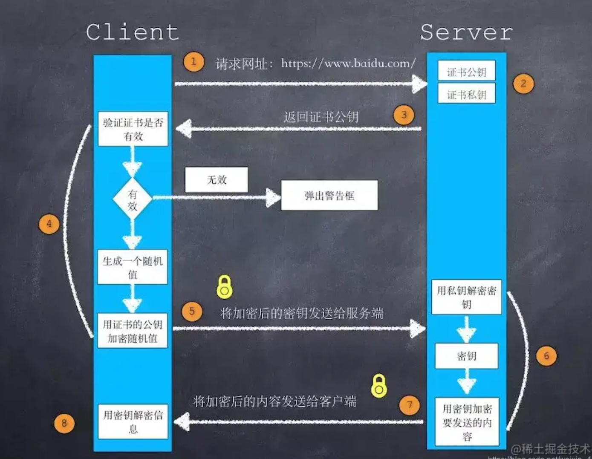

- 第一章 http概述
	- MIME(Multipurpose Internet Mail Extension)数据格式标签，用来记录文件类型
	- URI（Uniform Resourse Identifier）统一资源标识符 等于URL
	- 网关是一种特殊的中间实体服务器，常用于将Http流量转换为其他协议来获取文档
	- Http隧道 常用于在http的连接上传输非http的网络流量
-
- 第二章 url
	- url的主要结构 方案://服务器位置/路径 但不止限于上述三个组件 还有主机 端口 参数 查询 片段 ftp需要提供账号密码
	- 方案名不区分大小写
	- http的**端口**默认为80
	- **路径**中每段可以有不同的参数
	- 问号右边的内容是**查询**语句
	- ＃后面表示的是**片段** 片段仅由客户端使用 并不发送给服务器
	- 在url中需要**对非安全字符进行编码** 目的是为了统一标准 减少歧义 但不能对安全字符进行过度编码 因为会造成web过滤程序失效
	- url的一个缺点是当资源转移了，url就失效了
	- url的另一个终极代替方案是**urn** 设置一个中间资源定位符 这样不管资源转移到哪里 用urn永久都可以访问到所需资源
-
- 第三章 HTTP报文
	- 三大部分：起始行、首部、主体
	- **起始行**分请求行和响应行
		- 请求行中有 <方法> <url> <协议号>
		- 响应行有<协议号><状态码><原因短语>
	- **首部**表示主体的附加信息
		- 可拓展
		- 名值对的形式
		- 多出来的换行内容要至少有一个空格或制表符（tab）
	- **主体** 是HTTP要传输的内容
	- 要注意http的**协议号**，过老的版本对新特性无法兼容
	- **方法**
		- GET和HEAD被认为是安全方法，因为不会对服务器造成影响
		- HEAD请求返回的首部和GET返回的首部完全相同，目的是在不获取资源的情况下，对资源的首部进行检查
		- PUT用于根据URL和请求主体创建一个新文档或替代已有的旧文档
		- POST常用于提交表单数据，由服务器来处理接收到的数据。
		- 因此PUT用来向服务器上的资源存储数据，而POST则是向服务器发送数据
		- TRACE用于检查请求在传输给服务器的过程中经过了哪些节点，TRACE的响应部分包含服务器收到请求的精确副本。注意：TRACE的请求实体不能有主体。
		- OPTIONS请求服务器告知其支持的方法。
		- DELETE 注意：服务器可以在不通知客户端的情况下撤销请求。
	- **状态码**
	- 100~199 信息性状态码
	- 200~299 成功状态码
	- 300~399 重定向状态码
	- 400~499 客户端错误状态码
	- 500~599 服务器错误状态码
-
- 第四章 连接管理
- tcp的连接通过<源IP地址、源端口号、目的IP地址、目的端口号>来识别，这四个值一起唯一地定义了一条连接
- [[API]]
- [[套接字]]
- [[connection首部]]
- HTTP的连接方法
- **串行连接、并行连接**
- 并行连接会让人“感觉”比串行连接更快一些，因为串行时，浏览器在对象加载完毕之前无法获知对象的尺寸，在加载足够多的对象之前，无法在屏幕上显示任何内容。而并行连接可以让用户看到屏幕上有很多动作在进行。
- **持久连接**
	- 应注意keep-alive和哑代理（不支持connection首部的代理），
	- 为了解决哑代理不能维持keep-alive的功能这个问题，部分浏览器提出了proxy-connection（聪明代理）
- **管道化连接**
	- 在持久连接的基础上，又提出了管道化连接，客户端可以在发送请求之后立即发送下一个请求，而无需等待上一个请求的响应。
	- 但管道化连接也有风险，比如执行一些POST操作（非幂等请求）上传订单时，若连接突然中断，此时重新打开连接重发，会有产生多张订单的危险。因此客户端不应该以管道化的方式传送非幂等请求。
- **正常关闭连接**
	- 关闭连接的输出信道总是安全的，对方从缓冲区中读出所有的缓存数据并接受一条通知后，就知道你的输出连接已关闭。
	- 但关闭连接的输入信道比较危险，对方可能并不知道连接已关闭于是仍然发送请求。这时候操作系统会向请求端回送TCP“连接被对端重置”的报文，并会清空请求端的输入缓冲区，这是非常糟糕的情况。
	- 因此，关闭连接时，应先半关闭输出信道，当两端都告知对方不会再发送请求时，再把输入信道关闭，这样就不会有重置的危险。
-
- 采用「混合加密」的方式的原因：
- **对称加密**只使用一个密钥，运算速度快，密钥必须保密，无法做到安全的密钥交换。
- **非对称加密**使用两个密钥：公钥和私钥，公钥可以任意分发而私钥保密，解决了密钥交换问题但速度慢。
- 