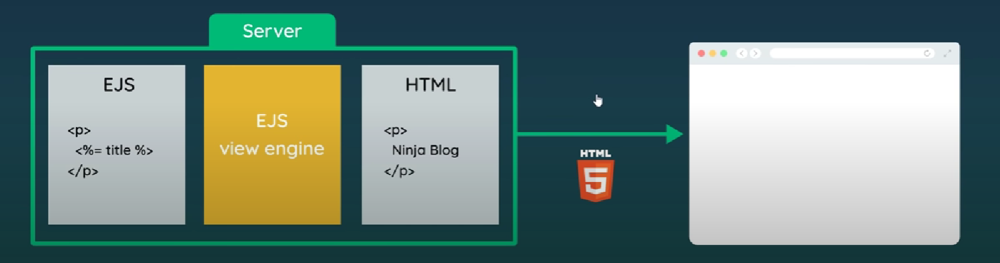
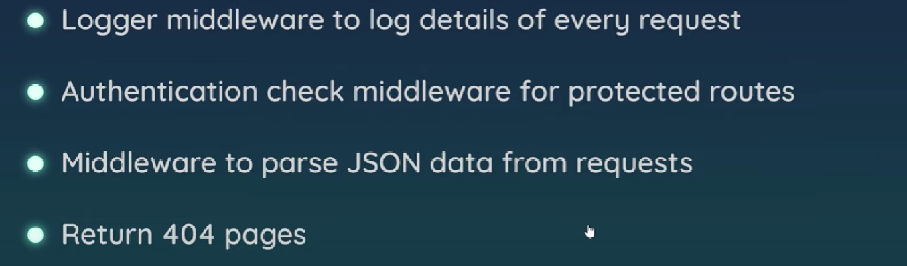
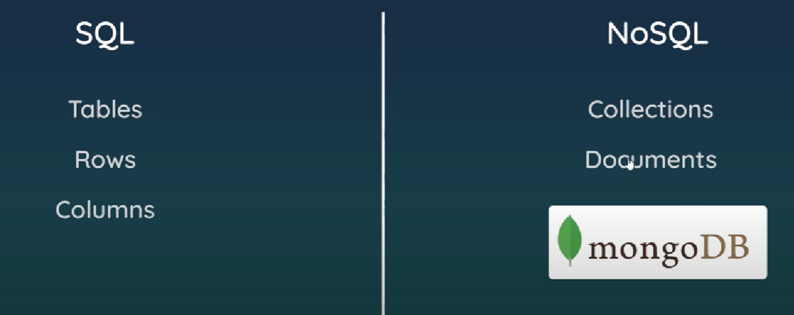
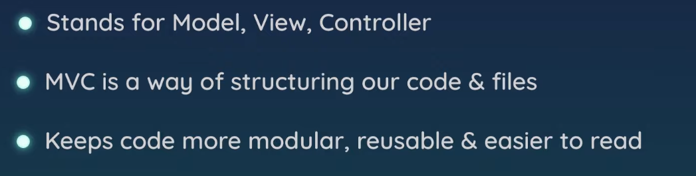

- 当谈到 Node.js 时，它是一个基于 Chrome V8 引擎的 JavaScript 运行时环境，而不是一个具体的框架或语言。它允许开发者使用 JavaScript 编写服务器端代码，用于构建高性能的网络进程服务。
- Node.js 是单线程非 I/O 阻塞的运行时环境。在网络进程服务中，通常会有大量的高并发异步请求。Node.js 通过事件驱动和非阻塞 I/O 模型来应对这些场景，主要依赖于事件循环机制。
- 事件循环是 Node.js 异步编程的核心机制。它是一种处理异步任务的机制，主要通过任务队列（Task Queue）和执行栈（Call Stack）来管理和调度各种事件和任务的执行。当主线程遇到一个异步任务时，并不会立即执行它，而是将其委托给底层系统（如 libuv），然后继续执行后续任务。异步任务完成后，将对应的回调函数放入任务队列中等待事件循环执行。
- 事件循环不断地检查任务队列，如果执行栈为空，则会从任务队列中取出任务并放入执行栈执行。当执行栈再次为空时，进行下一轮事件循环。这种机制保证了 Node.js 的单线程在等待 I/O 操作的同时能够执行其他任务，从而提高了程序的并发处理能力，使得 Node.js 更适合处理高并发和 I/O 密集型任务。
-
-
- ### Node.js 与 Koa 框架的区别：
- **Node.js**：
	- 是 JavaScript 的服务器端运行环境，使得 JavaScript 能够在服务器端运行。
		- 提供了处理网络请求、文件操作等功能的基础环境。
- **Koa 框架**：
	- 是基于 Node.js 的一个轻量级 web 框架，用于构建网络应用。
		- 提供了简洁、灵活的工具和中间件，帮助开发者更方便地构建 Web 应用。
- ### SSR（服务器端渲染）与 CSR（客户端渲染）的区别：
	- **SSR（服务器端渲染）**：
	- 在服务器端完成页面的渲染和模板编译，将最终的 HTML 直接发送给浏览器展示。
		- 首次加载速度快，对 SEO 更友好，因为搜索引擎能直接获取到完整的页面内容。
	- **CSR（客户端渲染）**：
	- 浏览器接收到 HTML 后，需要下载并执行 JavaScript 文件，然后在浏览器端进行解析和渲染。
		- 交互性强，用户体验更流畅，但首次加载速度较慢，对 SEO 不够友好。
-
-
-
- JS在浏览器上运行在V8 engine  （C++）
- browser有**windows**全局对象，node有**global**全局对象，但两者有区别
- __dirname可以获取当前目录，__filename可以获取当前文件名
- modules
	- 要想调用其他文件的内容，使用require，且在其他文件中需要用modules.export选中输出的内容
	- 常使用解构来引用其他文件的对象
- node有很多core module，比如说os，fs
- fs
	- 读、写、创建、删
	- fs的操作是异步的
	- 第一个参数是文件路径，最后一个参数往往是回调函数
	- 读操作的data返回的是buffer，要想展示实际内容，可用data.toString
	- existsSync可以用来检测是否有某个文件，rmdir用来删除文件夹，unlink用来删除文件
	- **stream**
		- 使用buffer来传输数据，适用于大文件，如视频
		- createReadStream
		- creatwWriteStream
		- pipe可以将一个可读的文件的数据写到可写的文件中
-
- http
	- localhost 127.0.0.1 own computer
	- node端每次更改代码后要重新运行项目
	- 路由选择 根据url的内容 使用switch...case对页面进行选择
	- express包用来解决复杂的路由和请求问题
-
- node包
	- nodemon是热重载
	- npm init会生成package.json
	- npm网址npmjs.com
	- lodash是一个实用的JS库
	- 上传代码时不用上传node.module  npm install能自动安装package.json中的依赖
- express框架
	- express不知道相对url，引用其他文件时设置一个根目录
	- app.use()方法必须放在代码最后，当找不到匹配的页面后，才调用app.use()中的404页面
	- view engine可以传入动态数据（存放在服务器或数据库） 在前端使用<% %>标签来调用app的数据以及写控制逻辑
	- {:height 176, :width 638}
	- html中的head标签用来保存machine可以理解的信息。
-
- middleware
	- middleware指的是后端执行方法的代码，app.get(),app.use()等等
	- 
	- next.()用来继续执行代码
	- express框架有很多中间件，如：
	- Morgan()获取request的详细信息，包括方法，url等等
	- 浏览器不可以直接使用静态资源如image.css文件，得新建一个public文件夹来存放这些静态公共资源。
-
- mongoDB
	- 
	- mongoose用来连接数据库
	- 定义model（数据库文件）和schema（数据库存放的文件的数据结构）
	- 在middleware app.get()中调用数据库的数据并渲染到前端
-
- Get,Post&Delete Requests
	- 用:id来获取具体的页面
	- delete方法 在前端运用ajax的方法向后端发起fetch，后端处理完后返回一个重定向的url，前端接收该url并跳转。
-
- MVC
	- {:height 197, :width 748}
	- 用来整理项目，提升代码的复用性和可读性
-
- nodejs的电子书
- 看完课之后用以伴项目做练习
-
-