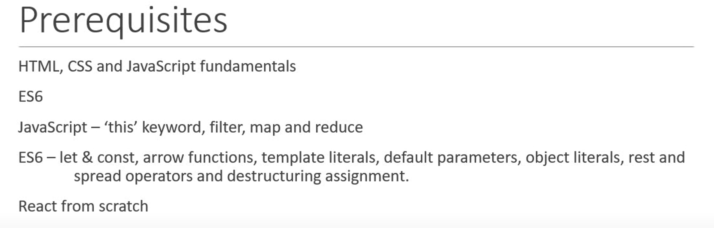

- 前置知识
  collapsed:: true
	- 
- 课堂小结
	- components
		- 两种类型
			- stateless functional components
			- stateful class components
		- 可嵌套
	- Functional vs Class
		- Functional比较简单，没有this关键字，无状态，主要用于UI
		- Class有更多的特性，有私有数据，复杂的UI逻辑，有生命周期的hook
	- JSX（Javascript XML）
		- 是react的语法糖
		- 与html的一些不同
			- 驼峰命名法
			- class->className
	- props
		- 常用于展示静态数据
		- 在components间传递
	- setState
		- 修改动态的值时，不能直接修改，而应使用setState
		- 查看setState的值应使用callback函数，而不是在setState函数后面直接打印，因为会发生异步现象
		- setState若直接多次对对象进行相同的更新，会因为react的批处理而导致不能获得预期的效果，所以需要用functional来setState。（prevState是setState定义的）
		- ```javascript
		  state = {
		     count: 0
		  }
		  updateCount = () => {//错误用法
		      this.setState({ count: this.state.count + 1});
		      this.setState({ count: this.state.count + 1});
		      this.setState({ count: this.state.count + 1});
		      this.setState({ count: this.state.count + 1});
		  }
		  updateCount = () => {//正确用法
		      this.setState(prevstate => ({ count: prevstate.count + 1}));
		      this.setState(prevstate => ({ count: prevstate.count + 1}));
		      this.setState(prevstate => ({ count: prevstate.count + 1}));
		      this.setState(prevstate => ({ count: prevstate.count + 1}));
		  }
		  ```
		-
	- event handler（事件处理程序）
	  collapsed:: true
		- 不用函数调用（即不用加括号）
			- ```javascript
			  function FunctionClick(){
			      function clickHandler(){
			          console.log('button clicked')
			      }
			      return(
			          <div>
			              <button onClick={clickHandler}>
			                  click
			              </button>
			          </div>
			      )
			  }
			  ```
		-
	- 事件绑定有四种方法，其中最常见的是在constructor中加入箭头函数用于事件绑定。或是class中新建箭头函数。若有参数传递，则在render中用this来绑定。
	- parentComponent和childComponent
		- 传值子传父得通过箭头函数来传。箭头函数后面接的函数得有（）。
	- 条件渲染（一般使用③④种）
		- ①默认元素变量 
		  ```javascript
		   if (this.state.isLoggedIn) {
		              return (
		                  <div>
		                      welcome plus
		                  </div>
		              )
		          } else {
		              return (
		                  <div>
		                      welcome guest
		                  </div>
		              )
		          }
		  ```
		- ② 自定义变量
		  ```
		  		let message
		          if (this.state.isLoggedIn) {
		              message = <div>welcome plus</div>
		          } else {
		              message = <div>welcome guest</div>
		          }
		          return <div>{message}</div>
		  ```
		- ③条件三元操作符
		  ```
		  return (
		              this.state.isLoggedIn ?
		                  <div>welcome plus</div> :
		                  <div>welcome guest</div>
		          )
		  ```
		- ④短路操作符
		- ```
		  return this.state.isLoggedIn && <div>welcome plus</div>
		  ```
	- list渲染
		- 将数据重构成一个独立的compone，分离列表与数据，使代码更简洁优雅
		- key
		  collapsed:: true
			- 使用map时，要有key属性，key是为了方便react检查DOM树的变化，避免当元素发生顺序变换时，进行多余的DOM更新。
			- 当list中没有unique的key时，react会默认使用index
			- 使用index as key时，应满足以下条件，否则list会出现错乱。
				- list中没有唯一的id
				- list的数据不会变
				- list不会重新排序或者过滤
			- 当不能使用index而且没有unique id时，可以使用npm来生成唯一随机数作为id
	- 控制组件三步走
		- type
		- value
		- onchange方法
	- 生命周期四大件
		- component mount lifecycle
		  collapsed:: true
			- constructor
			- getDerivedStateFromProps
			- render
			- componentDidMount
			- 若有子组件，则依次执行到父组件的render后，开始依次执行子组件的生命周期函数，最后执行父组件的componentDidMount
		- component update lifecycle
		  collapsed:: true
			- getDerivedStateFromProps*
			- shouldComponentUpdate*
			- render
			- getSnapshotBeforeUpdate*
			- componentDidUpdate
			- 其中，打*号的并不常用。若有子组件，则依次执行到父组件的render后，开始依次执行子组件，直到执行完自组建的getSnapshotBeforeUpdate后，继续执行父组件的getSnapshotBeforeUpdate，然后执行子组件的componentDidUpdate，最后执行父组件的componentDidUpdate。
		- componentWillUnmount是销毁方法
		- error handling phase
	- fragment
		- 允许对一组子元素进行分组时，无需向DOM添加额外的节点
		- 可以有key属性，用于map（）
		- 当没有key时，可以用<></>来代替<React.Fragment><React.Fragment/>
	- pureComponent
		- 每当父组件重新渲染时，React 通常都会重新渲染该组件。作为一种优化，可以创建一个组件，只要其新的 props 和 state 与旧的 props 和 state 相同，React 就不会在其父级重新渲染时重新渲染。
		- 当使用pureComponent的时候，应注意shallow comparison的问题，新增记录时应重新创建数组或者对象，而不采用引用的方式
		- React.memo(memoComp)用于functional component，可以使其达到pureComponent同样的效果
	- ref
	  collapsed:: true
		- ref 是一个应急方案，用于保留不用于渲染的值。 你不会经常需要它们。
		- ref 是一个普通的 JavaScript 对象，具有一个名为 `current` 的属性，你可以对其进行读取或设置。
		- 你可以通过调用 `useRef` Hook 来让 React 给你一个 ref。
		- 与 state 一样，ref 允许你在组件的重新渲染之间保留信息。
		- 与 state 不同，设置 ref 的 `current` 值不会触发重新渲染。
		- 不要在渲染过程中读取或写入 `ref.current`。这使你的组件难以预测。
		- ref不能用于functional component
		- ref不是一个props，当需要引用一个higher order component时，ref会默认引用外层的ref而不是wrapped的ref，因此需要使用React.forwardRef()进行转发。
	- createPortal（nb）
	  collapsed:: true
		- lets you render some children into a different part of the DOM
		- https://react.dev/reference/react-dom/createPortal
		-
	- error boundary
	  collapsed:: true
		- 用于捕获DOM tree和component tree的错误，不能用于onclick（）这类函数的错误控制（此类应用try catch方法）
		- 通过定义getDerivedStateFromError和componentDidCatch lifecycle method来实现
		- 根据需要来控制全部UI还是个别UI的错误边界
	- higher-order component(HOC)
		- 传值时，应在wrappedComponent中加入{...this.props}，因为在app.js中传入props时，传给的是HOC而不是wrappedComponent。
		- 注意命名规范，HOC更像是一种函数，首字母不用大写，而Component则一律需要大写。
	- render props
		- 这玩意真抽象，和HOC一样，是代码共享的一种方法
		- render变量可以改为children，在组件的属性中，{}等同于this.props.children
	- Context
		- 目的是当有多层的component嵌套时，props能直接传递给需要的component
		- context由两部分组成，provider和consumer
		- 有两种方式，一种是用consumer来获取props，一种是用context.type来获取，后者的缺点是只能用于单一的props获取。
-
- [[React by ninja]]
- [[next.js学习笔记]]