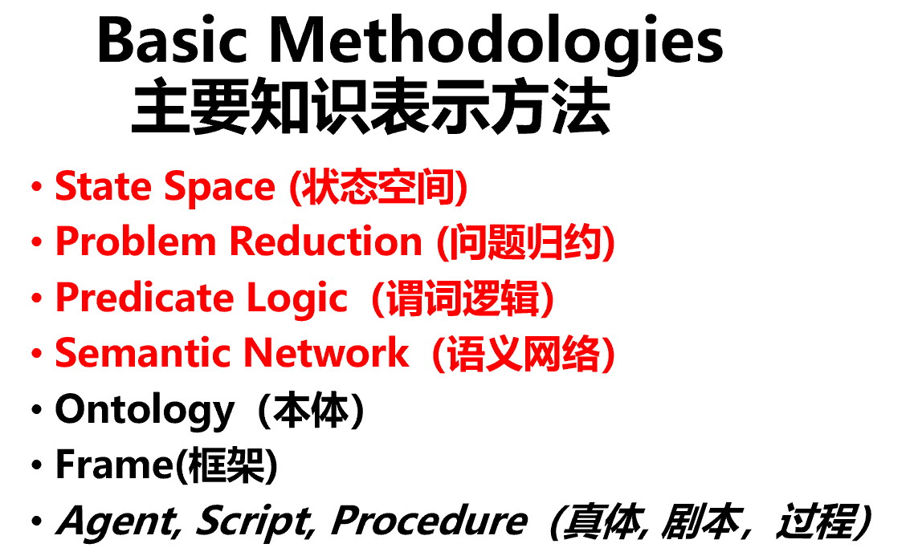

-
- 题型（分值分布未知）
  id:: 6521392b-4610-4b2b-b222-76c7a470b57c
	- 选择
	- 填空
	- 简答
	- 求解（估计会有消解反演）
-
- 第一章 绪论
- 人工智能的起源与发展 他提到了
- 学派去年考过了 他说今年不会考
- 其他可以大致看一下ppt
-
- 第二章 知识表达
	- 问题表示的三要素 着重了解一下
	- {:height 224, :width 328}
	- 红色字体的是重点，会以八数码的形式出题。后面三个黑色字体的不做要求
	- 置换合一
	-
- 第三章 搜索技术
	- open表、close表
	- 搜索算法中节点的扩展顺序
	- 启发式搜索 重点
	- 八数码 估价函数
-
- 第四章
	- 9步求解子句集
	- 消解反演
-