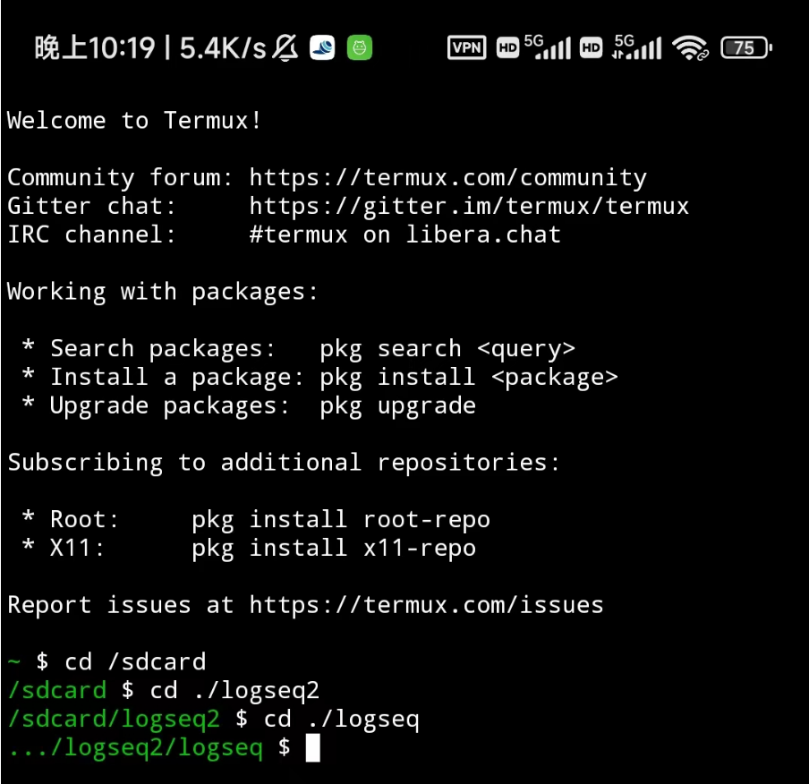
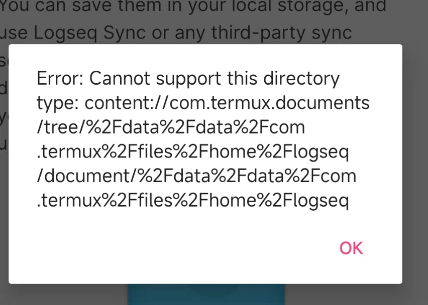
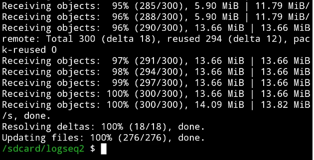
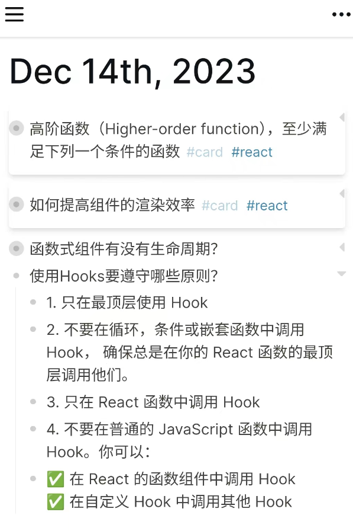
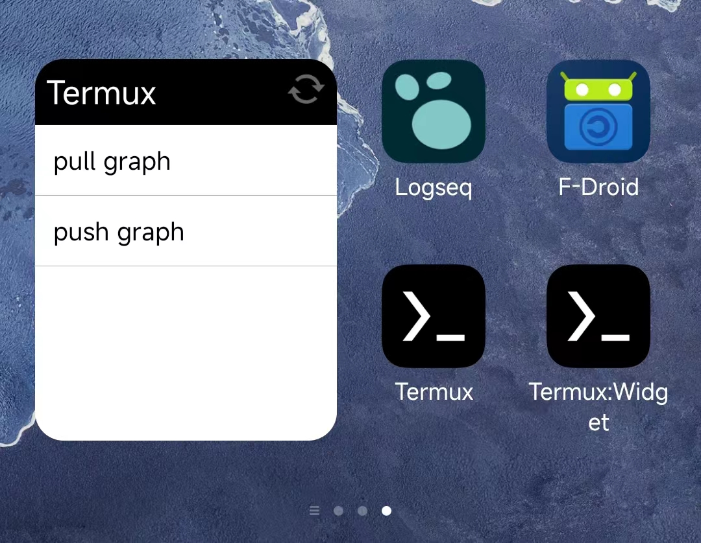

## 背景
	- 之前一直用logseq桌面端，但平时的碎片化笔记都是记录在语雀上，为了笔记记录的标准化流程，同一将笔记放到云端上，多端通过云端实现数据同步。logseq本身自带sync同步功能，但目前还处于内测阶段，而且要donate5美元以上的用户才能体验，于是就有了自行搭建同步服务的想法。
- ## 方案
	- 核心思想是将数据保存到Github仓库上，不同端的操作类似多人协作的过程，使用git来进行代码的管理。
-
- ## 实现步骤
	- 首先是创建一个GitHub仓库，一开始用的是private，但后面为了方便移动端推送又改为了public
	- 接着是对电脑端的logseq进行代码管理，在logseq根目录`git init`，再设置好远程仓库的地址，然后在`.git`目录中添加`post-commit`和`pre-commit`这两个文件，目的是为了让logseq获得commit和push的能力，具体的流程可参阅[Logseq-Git-Sync-101(Windows)](https://github.com/CharlesChiuGit/Logseq-Git-Sync-101/wiki/For-Windows-users)。
	- 此时可以在logseq的设置中勾选`auto commit`及设置间隔的时间，logseq的变更就会自动地推送到github上。
	- 然后就是移动端的部分了，桌面端的部署对有使用过github的读者来说应该不会太困难，但是移动端我们要怎么部署呢？移动端上没有终端，就没有使用git的载体。于是我们接下来的工作就是建立在一个叫**Termux**的移动端终端上，通过Termux来实现类似桌面端的部署。
	- Termux可以通过Github上发行版本的apk进行下载，也可以先下载一个叫F-Droid的应用商店，然后在里面下载Termux。下载完Termux后，神奇的一幕就发生了，我们熟悉的小黑框出现在了小小的手机屏幕上
		- {:height 300, :width 289}
	- Termux下载完成后，我们需要输入`termux-setup-storage`创建一个用来存放Termux下载文件的内部空间，以及连接外部空间，接下来就可以给手机安装git了。进行到这里，我以为按照[Logseq-Git-Sync-101(Android)](https://github.com/CharlesChiuGit/Logseq-Git-Sync-101/wiki/For-Android-users)的指引直接在Termux的内部空间创建一个文件夹然后将logseq指向这个地方就能进行git的拉取和推送，但但我打开logseq进行链接的时候，出现了下面的报错😭
	- {:height 232, :width 292}
	- 这个报错的大概意思就是logseq不能访问Termux的内部空间...正当我寻觅了网上很多方案都无果时，突然想到Termux可以访问外部空间。既然如此，我们可以在Termux的外部空间（也就是sdcard）建立一个git的本地仓库文件夹，再从logseq中import这个本地仓库的数据。经过一番操作之后，成功在手机上拉取github的数据✌！
	- > In the Termux terminal, type `termux-setup-storage` to allow Termux access to your internal storage and/or SD card
	- {:height 226, :width 339}
	- logseq上也能正常显示数据。
	- {:height 242, :width 166}
	- 最后要考虑的问题是，手机如何频繁拉取和推送Github上的数据呢🤔？最直接的方法是直接在Termux上进行拉取（pull）和推送（add -> commit -> push）的操作，但每次记录笔记都要手动pull和push显然会消磨记笔记的冲动。于是使用了[Logseq-Git-Sync-101(Android)](https://github.com/CharlesChiuGit/Logseq-Git-Sync-101/wiki/For-Android-users)中提到的Termux Widget方法，简单来讲就是提前写好脚本放到Termux内部空间的.shortcuts文件夹中，然后在手机的空白位置创建一个点击即运行`pull`和`push`的小部件。
	- {:height 161, :width 196}
	- 移动端的工作流是在记录笔记前先`pull`桌面端的笔记，然后记录笔记，记录完之后再`push`到GitHub上。而桌面端因为设置了自动commit和推送，所以只需手动进行pull操作即可，而我平时记录笔记主要也是用桌面端的logseq比较多，移动端主要是用来记录灵感、复习笔记和充分利用logseq的记忆卡片功能。
- ## 有待完善的地方
	- 手机进行push的时候每次都要输入github的用户名和token凭证，目前是将其保存到了输入法的常用语中，使用起来体验不是很好。
	  logseq.order-list-type:: number
	  id:: 657b199b-a8d7-481d-a322-63b30c0bcb38
	- push前如果没有pull的话可能会造成冲突，解决方法是使用git merge，但方法的原理不是很清楚。
	  logseq.order-list-type:: number
	- 桌面端有时候会显示commit失败的情况。
	  logseq.order-list-type:: number
-
- ## 总结
	- 本来早上只是想记录一下掘金闪念上的笔记，但无意间发现了logseq的一些隐藏功能和移动端版本，于是就有了构建这套两端同步工作流（p2p？）的想法。
		-
		- 中途踩了不少的坑，比如说
		  logseq.order-list-type:: number
		- 移动端logseq的无法链接Termux的内部空间
		  logseq.order-list-type:: number
		- 写pull和push脚本时候的路径问题，用//就可以指向根目录
		  logseq.order-list-type:: number
		- 移动端git push的时候身份验证问题，要设置token而不能用secret。
		  logseq.order-list-type:: number
	- 但同时也收获了不少：
		- Termux基于linux，linux的命令行操作更熟练了
		  logseq.order-list-type:: number
		- 相比以前能快速定位问题，阅读英文文档相对没那么吃力了
		  logseq.order-list-type:: number
		- 对手机的文件管理系统有了进一步的了解
		  logseq.order-list-type:: number
		- 没有被次要问题带偏，着力解决目标问题
		  logseq.order-list-type:: number
		- logseq.order-list-type:: number
-
	-