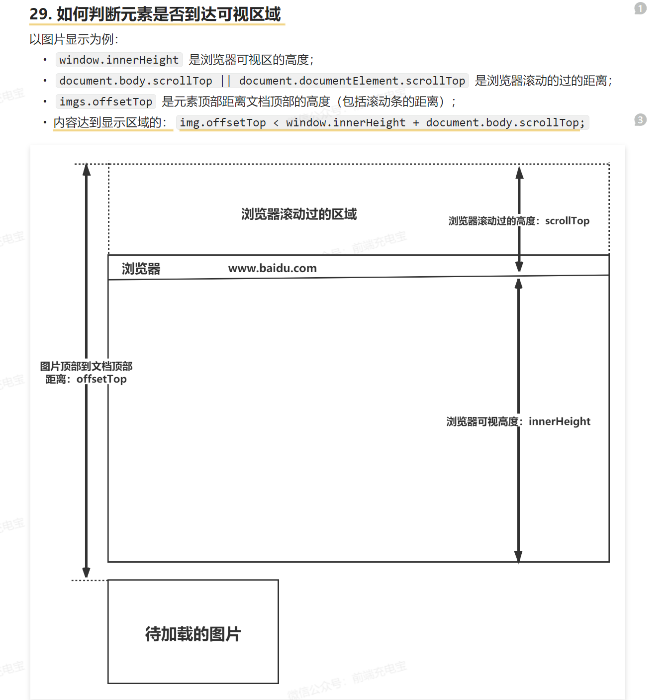

- 图片懒加载
	- 用来做提高首屏渲染速度
	- 实现的原理是判断图片是否到达了可视区域
	- src使用一个占位图片
	- 如果到了就更改图片的src属性为data-src，
	- 先获取所有图片的 dom，通过 `document.body.clientHeight` 获取可视区高度，再使用 `element.getBoundingClientRect()` API 直接得到元素相对浏览的 top 值， 遍历每个图片判断当前图片是否到了可视区范围内
	- 绑定window的scroll事件，进行事件监听
	- 但是这样存在较大的性能问题，因为 `scroll` 事件会在很短的时间内触发很多次，严重影响页面性能，为了提高网页性能，需要一个节流函数来控制函数的多次触发
	- 
	- 或者使用Intersection Observer这个API可以自动监测页面上的元素和视口之间的交叉状态。
	  id:: 654340c2-14f6-44b3-aafb-c334862f6a90