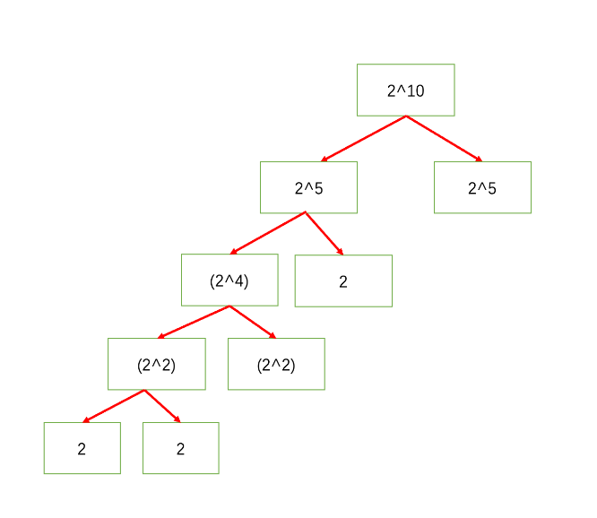

- 9.5
- 刷完第二题后随机跳到了二叉树，于是顺带复习了二叉树的前中后序遍历，主要看了用栈实现的迭代法,本质上是深度优先搜索。
- 迭代法中的前序和后序遍历是有相关联的，前序遍历的中间结点顺序是**中左右**，而后序遍历是**左右中**。所以只需把前序遍历压入栈的左右顺序改变，则可变成**中右左**，然后再反转数组结果即可得到**左右中**。
- 迭代法具体实现中运用了cur来记录当前结点，应记住，二叉树本身在遍历过程中是不会发生变化的，是参照物，变化的是栈和cur，应结合具体的图来理解。
- 其次是递归的方法，递归应注意三个地方
	- 确定递归函数的参数和返回值
	- 确定终止条件
	- 确定单层递归的逻辑
-
- 9.6
- 今天刷了3道，第一道是二叉树的深度，其原理和求二叉树的高度有关联
- **因为代码的逻辑其实是求的根节点的高度，而根节点的高度就是这棵树的最大深度，所以才可以使用后序遍历。**
- 二叉树节点的深度：指从根节点到该节点的最长简单路径边的条数。
  二叉树节点的高度：指从该节点到叶子节点的最长简单路径边的条数。
- 第二道是二叉树的镜像，利用前序遍历将左右子树交换即可。
- 第三道是“二叉树中和为某一值的路径”，判断是否有从根节点到叶子节点的节点值之和等于 sum 的路径。叶子节点是指没有子节点的节点。这一题还没有理解。
-
- 9.7
- **“从上往下打印二叉树”**，这一题用了二叉树层序遍历的思想，也就是广度优先搜索，数据结构使用的是队列，关键在于记录每一层队列的长度，在每一次弹出队列元素时加入该元素的左右孩子，每遍历完一层队列时下一层的元素也就全部加入到队列中，重新记录队列的长度，以此类推，直至队列的长度为0。
- **“判断是不是平衡二叉树”**，这一题考察了平衡二叉树的概念以及二叉树的高度。要判断左右两棵子树的高度差是否大于一，求高度的问题要自下而上遍历，原因是高度是从下往上递增的，所以采用后序遍历的方法。递归的单层逻辑是判断左右两棵子树的高度差，若大于1则返回 -1,否则返回左右两颗子树的最大者再加一，得到父节点的高度，层层返回。最后判断根节点的高度是否等于-1。
- 层序遍历可以用来求深度，但不可用来求高度。层序遍历是从上往下逐行遍历，而高度得从下往上遍历。
-
- 9.8
- “**对称的二叉树**”，这一题思路会比较难想到，因为是内侧和内侧，外侧和外侧作比较。
- 方法用的是**后序遍历递归**，第一步是确定返回值是布尔值、参数是节点的左右孩子；
- 第二步是确认终止条件，可以拿根结点来做参考，当左右孩子其中有一个不为空，另一个为空时，返回false。当两个节点均为空时，返回true。当两个节点均不为空但值不等时，返回false。当左右孩子值相等时，进入下一层递归；
- 第三步是确认单层的递归逻辑，应让左孩子的左节点与右孩子的右节点比较，然后是左孩子的右节点和右孩子的左节点比较，然后两种情况做与运算得到结果返回给上一层。
-
- 9.11
- “**在二叉树中找到两个节点的最近公共祖先**”同样地，递归三部曲
- 当子节点为p,q或空时，直接返回该结点
- 接着开始进入递归
- 递归逻辑：当左右子节点均不为空时，返回当前节点的值。
- 当左节点为空，右节点不为空时，返回右节点的值
- 当右节点为空，左节点不为空时，返回左节点的值
- 当左右节点均为空时，返回空
- “**二叉搜索树的最近公共祖先**”没有看参考资料自己做出来了，纪念一下🎈
- ## What is Binary Search Tree?
- **Binary Search Tree** is a node-based binary tree data structure which has the following properties:
	- The left subtree of a node contains only nodes with keys lesser than the node’s key.
	- The right subtree of a node contains only nodes with keys greater than the node’s key.
	- The left and right subtree each must also be a binary search tree.
- 利用二叉搜索树的特点，当节点值位于p,q之间时，此时节点就是LCA
- 当节点均小于p，q时，说明LCA在节点的右子树中，于是向右递归。
- 当节点均大于p，q时，说明LCA在节点的左子树中，于是向左递归。
- 此时，只要遇到和p或q值相同的节点，该结点就是LCA，直接返回即可。
- BTW，Leetcode和牛客上的参数和返回值可能会不一样，要看清楚题目说明
- ```
  * @param root TreeNode类
   * @param p int整型
   * @param q int整型
   * @return int整型
   */
  function lowestCommonAncestor(root, p, q) {
      if (root === null) return null;
      if (root.val === p || root.val === q) return root.val;
      //若根节点的值位于p,q之间，则根节点为LCA
      if (root.val > p && root.val < q) return root.val;
      if (root.val < p && root.val > q) return root.val;
      //若根节点小于p和q，则进入递归左子树即可，反之同理
      if (root.val > p && root.val > q) {
          let left = lowestCommonAncestor(root.left, p, q);
          return left;
      } else if (root.val < p && root.val < q) {
          let right = lowestCommonAncestor(root.right, p, q);
          return right;
      }
      return null;
  }
  ```
-
- 9.14
- 不知道是不是太久没写算法题，竟然理解错体验，导致把简单的问题复杂化了，审题真的是很重要！！！
- 有些简单问题可以用set来解决，尽量少用object，能用map和array就尽量用。
- 明天继续刷排序题
-
- 9.16
- 在广图，字节在跳动😀
- {{video https://www.youtube.com/watch?v=XaqR3G_NVoo}}
- 这个视频直观地将归并算法演示出来，用艺术作为载体来表达艰涩难懂的算法，大为震撼。
- 9.17
- 侧重思维的题将思考过程写下来效果更佳。
- 9.18
- String.prototype.split()
	- 可以将字符串按某种规律拆解开来并放到一个数组中
- 回溯和递归先确定终止条件，再写单层逻辑，在单层逻辑中进行递归
-
- 9.20
- 用两个栈来实现队列
- 暴露了几个知识点，对象原型和原型链，数组的push（）结合map方法实现异步操作
- '包含min函数的栈'，看到了一篇很耐心的讲解，用一个stackMin栈来保存栈在不同状态下的最小值，简单易懂👍
- '翻转单词序列'，手写了一遍string.split()，看题解发现可以直接用😂，除此之外，数组转换成字符串，用了join这个方法，翻转数组用了reverse。不得不说，JS的方法集成度还是很高👍
- '栈的压入、弹出序列'，使用辅助栈来验证弹出序列是否存在，按照入栈序列依次入栈，当辅助栈的栈顶和出栈栈顶相同时，弹出栈顶元素，出栈列表的指针+1，继续验证当前栈顶元素是否和出栈栈顶相等，是则继续循环，否则跳出循环，让入栈列表的指针+1，继续加入新的元素到辅助栈中，当遍历完入栈列表的元素后，若辅助栈为空，返回true。
-
- 9.21
- '滑动窗口的最大值'，利用单调队列来实现。因为js没有deque的数据结构，只能利用数组来实现，利用deque来保存单调队列的下标，队头元素为最大值，遍历数组时判断当前元素和单调队列中的元素的大小关系，如果比队头的元素大，则清空队列，将当前元素的下标加入到队头，若比队头元素小，但比队尾元素大，则弹出队尾元素，再将当前元素push到队列中。除此之外，每次遍历时还要判断队头元素是否过期，判断的方法是将队头的下标和（i-size）作比较，若过期，则将队头元素shift掉。最后，还要加一个控制，判断当前遍历的元素是否满足一个窗口的大小，若满足，则开始记录最大值。
- 9.22
- '数字在升序数组中出现的次数',这题考察了搜索的知识。可以通过暴力求解，进阶解法是二分查找。首先要手写一个二分查找，得到目标数在数组中的下界。
- ```
   0 1 2 3 4 5 6
  [1,2,3,3,6,8,9]
  target:4
  left:0 4 
  right:7 5 4
  middle:3 5 4
  num[middle]:3 8 6
  
  function BinarySearch(nums,k){
          let left = 0,
              right=nums.length,
              middle;
          while(left<right){
              middle=(left+right)>>1;//这里的右移运算很关键，不然的话会得到一个小数
              if(nums[middle]>=k){
                  right=middle;
              }else{
                  left=middle+1;
              }
          }
          return right;
      }
  ```
- 这样一步一步调试，精确度比在纸上推要高，更为严谨，之后继续采用这个方法。
-
-
- 9.24 位运算
- 不用加减乘除做加法
- 二进制中1的个数
- 整数的整数次方
	- ```
	  function Power(base, exponent)
	  {
	      // write code here
	      if(exponent<0){
	          base=1/base;
	          exponent=-exponent;
	      }
	      let res=1;
	      while(exponent>0){
	          if(exponent&1) res*=base;
	           exponent>>=1;
	          base*=base;
	      }
	      return res;
	  }
	  ```
	- 快速幂
	- {:height 563, :width 639}
-
-
- 9.25
- &&和||有短路特性
- 当a&&b中的a为假时，不执行a；
- 当a||b中的a为真时，不执行b；
-
- 位运算总结
- a&1时，可以用来判断a最低位的情况
- 异或运算，同为0，不同为1，有交换律的特性。异或运算的使用场景更多。
- 使用while的时候，要记得注意外部是否需要return
-
- 9.26
- 搜索题型
- ‘旋转数组的最小数字’，考察了二分搜索，二分搜索可以先把大体代码写出来，节点细节部分可以在测试的时候微调。
- 这题的解题思路是将旋转数组看成两个递增的数组，要求找到较小的那一个。若nums[mid]比num[right]大，证明小数组在mid的右边，于是乎将left=mid+1,反之则right=mid。
- 当left==right时，nums[left]就是最小值。
- 0 1 2 3 4 5 6 7 8
- 4 5 6 7 8 9 1 2 3
- left：0 5 6
- right：8 6
- mid：4 6 5
- '二维数组中的查找'
- 将二维数组展开，然后暴力搜索
- 线性搜索，这个思路好，从左下角开始出发，若目标值比当前值大，则往右移动一格，若目标值比当前值小，则往上移动一个，直到找到目标值，返回true。