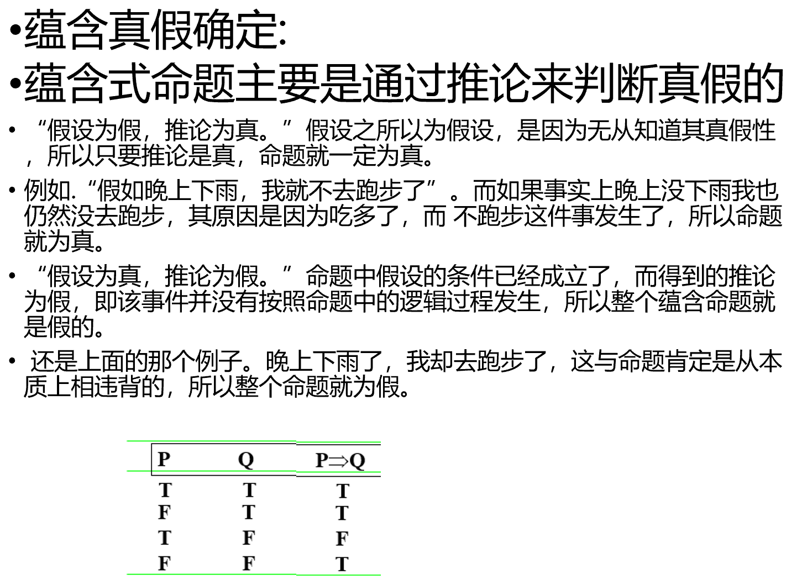
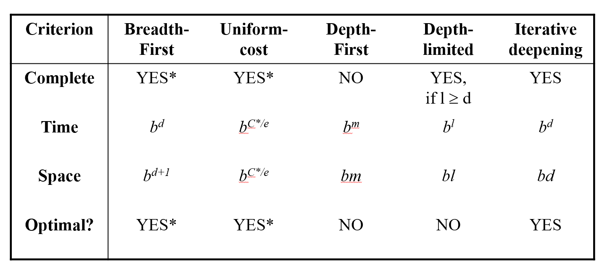
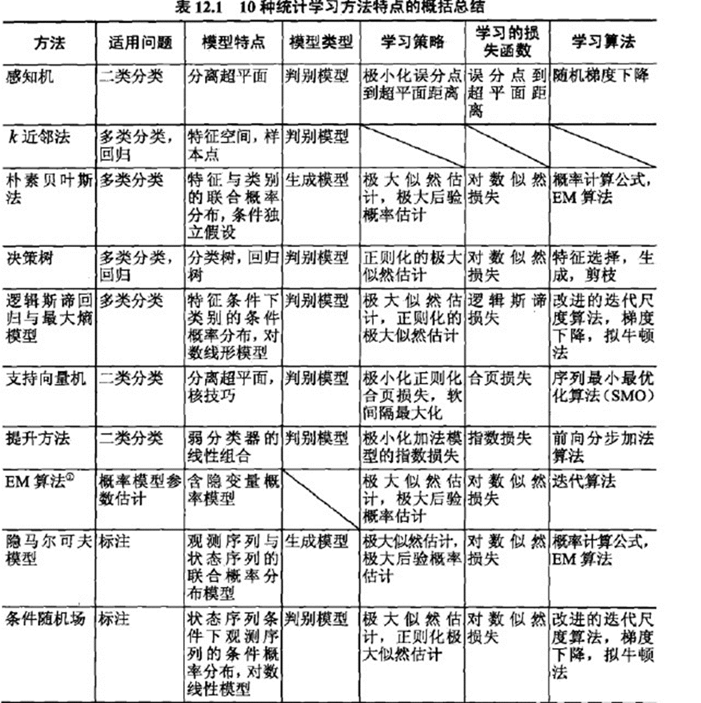

# 期末复习内容
	- ## 人工智能
		- 目标：人工智能能过及格线
		- 考试时间：下周五 文新206
		- 题型：选填、解答、综合
		- 有的资料
			- 教材
			- PPT
				- [1-绪论](D:\Desktop\Z\学习\人工智能课件\1-绪论.ppt)
					- 图灵机
						- 指头可以进行读写 0 1 或空
						- 纸带可以向左或向右移动
						- 指令集 经典的是100反转成011
							- |状态|操作|
							  |--|--|
							  |0|写为1，向右移动1位|
							  |1|写为0，向右移动一位|
							  |空|向右移动一位|
						- 现代计算机和嵌入式的本质都是图灵机，只是指令集变得复杂了
					- 人工智能的起源与发展
					  collapsed:: true
						- 孕育期->形成期->暗淡期->知识应用期->集成发展期
						- 有意思的是，人工智能八十年代刚进入中国的时候挂靠的是中社院的哲学系，被认为是歪门邪道，直到2004年才被中科院认可。
						- 知识应用期主要用于特定领域的应用，如帮助医生诊断患者等，直到后面CV、NPL、ML、神经网络等新兴应用领域的加入人工智能才重新被世人重视起来。
					- 人工智能学派
					  collapsed:: true
						- 符号主义
							- 认为人工智能基于知识表示、知识推理和知识运用
						- 连接主义
							- 认为人脑不同于计算机，人脑基于神经元之间的连接。人工智能应模拟大脑的工作模式，仿生学。
						- 行为主义
							- 认为智能取决于感知和行动，与知识和连接无关，认为人工智能能像人脑一样持续进化
					- 人工智能对人类的影响
					  collapsed:: true
						- 精神和心理上造成威胁
							- 可能会让很多岗位受到威胁
							- 人->机器 变成了 人->智能机器->机器
							- 让人变得懒惰 chatgpt会减少我们主动搜索和创作的欲望
						- 法规上的不完善
							- 自动驾驶出现事故时责任规定问题
						- 技术失控的风险
							- AI可能会失控，最近兴起的[超级对齐](https://openai.com/blog/introducing-superalignment)概念，目的就是要让AI和人类的普世价值观趋同。
						-
				- [2-知识表达](D:\Desktop\Z\学习\人工智能课件\2-知识表达.pptx)
					- {:height 120, :width 240}
					- 状态空间
						- 状态空间三元组，（起始态，中间态，最终态）
						- 一个问题求解系统中，所有可能状态组成的集合称为状态空间或状态图
					- 问题规约
						- 将问题拆分为若干个子问题，子问题再拆分为子子问题，直至本原问题（即问题的本质）。本原问题的集合就是问题的解。难点是逆向推理找到拆分子问题的依据。
						- 梵塔问题，逆向推理，可以拆分为子问题的依据，大的盘子永远要不能在小盘子上面。所以可以把最大盘子以外的盘子看作一个整体来移动。然后再去处理整体中的部分。
						- 与或图
							- 与图用小圆弧连接兄弟节点，表示只有当所有兄弟节点有解时，父节点才有解，而或图则只需要一个兄弟节点可解则父节点可解。
					- 谓词逻辑
						- 蕴含 如果p是false，q是true，则真值表为true
							- 可以理解为当p为false时，p与q无关，q无论取什么真值表都为true。基于真话才有定论，基于假话，可以真真假假
							- {:height 155, :width 237}
							- 语义网络的特点
								- 优点：结构性、联想性、自然性、自索引性
								- 缺点：推理规则不够明了、表达范围有限
				- [3-0-搜索技术](D:\Desktop\Z\学习\人工智能课件\3-0-搜索技术.pptx)
					- 图的搜索过程
						- open表记录还没走过的节点
						- close表记录已经走过的节点
						- 记住走过的路径
					- 判断一个搜索算法的性能
						- 完备性（有无解）、最优性（能否找到最优或最短路径）、时间复杂度、空间复杂度
					- ||完备性|最优性|时间复杂度|空间复杂度|
					  |--|--|--|--|--|
					  |BFS|✔|✔|O(b^d)|O(b^d+1)|
					  |UCS|✔|✔|𝑂(𝑏^(𝐶∗/𝜀))|𝑂(𝑏^(𝐶∗/𝜀))||
					  |DFS|❌（除非是有限状态图）|❌||
					  |IDS|✔|✔|比BFS增加了11%|O(bd) ||
					- 
					- 如果有双箭头的情况，应加入close表，否则可能会浪费很多空间或者是使用DFS时死循环
					- A*算法（一般按UCS做法来做）
						- 可采纳性：总能找到最短的解答路径。A*算法是可采纳的，A*算法就是指在一定条件下的A算法能保证找到最优解（g（x）大于0，h（x）不大于x到目标的实际代价）
						- h(x)<=h*(x),应设计接近h*(x)的A*算法，说明包含的启发式信息越多。但h(x)>h*(x),会使算法A*失去可采纳性。
						- 评价函数f（x）=g（x）+ h（x），其中g（x）是代价函数，h（x）是启发式函数
						- 如果g（x）= 0 ，A搜索接近于深度优先搜索（贪婪算法）。
						- 如果h（x）= 0 ，A搜索接近于宽度优先搜索（等代价算法）。
						- 可以加入一个权重w，使f(x)=g(x)+wh(x)
							- 在浅层时，使w取值较大，使g（x）占比小，突出启发函数，加速深度搜索
							- 在深层时，使w取值较小，使g（x）占比大，突出等代价搜索，往最优路径靠拢
						- 爬山法就是贪心算法
						- 回溯策略记录最近一次的分岔口，当当前路径无法继续搜索时返回分岔口选择另一个子节点进行搜索。
				- [3-1-推理](D:\Desktop\Z\学习\人工智能课件\3-1-推理.pptx)
					- 消解反演9步曲
						- **(1)****消去蕴涵符号**
						- **(2)****减少否定符号的辖域（狄****·****摩根定律）**
						- **(3)****变量标准化（哑元唯一）**
						- **(4)****消去存在量词****(****$****)**
						- **(****5)****化为前束形**
						- **(6)****化为合取范式****(∧)**
						- **(7)****消去全称量词****(****"****)**
						- **(8)****消去连词符号****(∧)**
						- **(9)****更换变量名称****(****同一变量不出现在一个以上子句****)**
					- 明天做消解反演的题
				- [3-2不确定性推理](D:\Desktop\Z\学习\人工智能课件\3-2不确定性推理.pptx)
			- 写过的作业
			- 自己整理的重点 [[人工智能原理课堂笔记]]
			- 人工智能课堂录音
			- 其他班老师的重点
				- 第一章：1.1节、1.2节、1.4节
				- 第二章：2.1节、2.2节、2.3节（谓词逻辑为重点）、2.4节
				- 第三章：3.2节、3.3节（**A***算法为重点）、3.4节（消解原理重点）
				- 第四章：4.4节（4.4.4遗传算法的遗传算子）
				- 第六章：6.2节（6.2.1机器学习的主要策略）
		- 复习方法
			- 总览一遍重点
			- 做题 遇到不懂的题型 不要死钻 搜题软件搜
			- 和同学讨论
	- ## 机器学习
		- ### 机器学习实验还没交😭 ddl 19周周日前
		- 目标：46分是底线 但是因为前面有一次考勤没来 所以得尽可能拿高分
		- 考试时间：下下周一 文新213
		- 有的资料
			- 教材：统计学习方法
			- PPT
			- 浩加整理的课堂笔记
			- 四班老师的重点
			- 自己课堂上的笔记
			- 写过的作业
		- 复习方法
			- 找到重点的内容
				- 模型复杂度、训练样本、测试样本和模型精度之间的关系
				- 分类与回归的定义区别是什么
				- 有监督、无监督、半监督之前的区别和联系是什么
				- 正则化的定义、作用和技巧 ⭐
				- 什么是过拟合和欠拟合
				- 什么是感知器算法
					- 二分类线性可分、超平面
				- 什么是K近邻算法 填空题
				- 朴素贝叶斯 ⭐
					- 会出一道给数据的计算题要求通过朴素贝叶斯计算出属于哪一类，有做过的例题，也可以参考书上P51 4.1例题
					- 为什么叫朴素贝叶斯
					- 贝叶斯定理公式
				- 决策树
					- 概念：信息量、熵、互信息、最大熵原理
					- 决策树基于互信息最大化原则自上而下构建
					- 概率和信息量成反比、等概率事件的熵最大
					- 不倒翁的不确定度为0
				- 线性回归 考基本概念
				- 逻辑回归 概念 sigmod函数
				- 梯度下降 概念 学习率 通过经验得到 法向量
				- 随机梯度 概念 随机取样 误分类驱动 结合感知机理解 和梯度下降的区别
				- SVM 概念 可线性 可非线性 有监督学习
				- adaboost 概念 弱分类器 -> 强分类器
				- PCA降维 主成分分析 概念 信息压缩 激活函数 sigmoid函数的作用
				- 聚类 层次聚类和k-means的区别和联系
				- 范数 L1L2范数 P范数 无穷范数 这个要会计算 ⭐
				- em算法不考
			-
			- 用google搜上述问题对应的答案
			- PPT和教材做补充
			- 再做一遍做过的题
			- 回忆老师讲过的重点
			-
		- 笔记记录
			- 统计学习三要素
				- 模型、策略、算法
			- {:height 260, :width 274}
			-