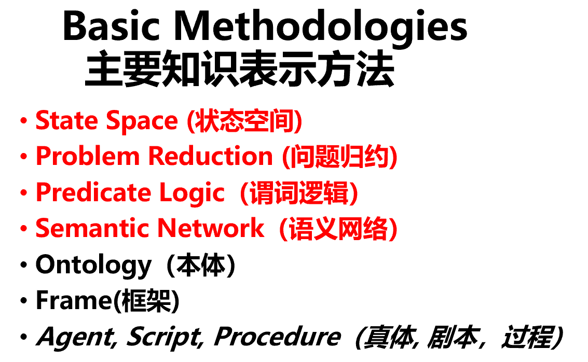

# 期末复习内容
	- ## 人工智能
	  collapsed:: true
		- 目标：人工智能能过及格线
		- 考试时间：下周五 文新206
		- 题型：选填、解答、综合
		- 有的资料
			- 教材
			- PPT
				- [1-绪论](D:\Desktop\Z\学习\人工智能课件\1-绪论.ppt)
					- 图灵机
						- 指头可以进行读写 0 1 或空
						- 纸带可以向左或向右移动
						- 指令集 经典的是100反转成011
							- |状态|操作|
							  |--|--|
							  |0|写为1，向右移动1位|
							  |1|写为0，向右移动一位|
							  |空|向右移动一位|
						- 现代计算机和嵌入式的本质都是图灵机，只是指令集变得复杂了
					- 人工智能的起源与发展
						- 孕育期->形成期->暗淡期->知识应用期->集成发展期
						- 有意思的是，人工智能八十年代刚进入中国的时候挂靠的是中社院的哲学系，被认为是歪门邪道，直到2004年才被中科院认可。
						- 知识应用期主要用于特定领域的应用，如帮助医生诊断患者等，直到后面CV、NPL、ML、神经网络等新兴应用领域的加入人工智能才重新被世人重视起来。
					- 人工智能学派
						- 符号主义
							- 认为人工智能基于知识表示、知识推理和知识运用
						- 连接主义
							- 认为人脑不同于计算机，人脑基于神经元之间的连接。人工智能应模拟大脑的工作模式，仿生学。
						- 行为主义
							- 认为智能取决于感知和行动，与知识和连接无关，认为人工智能能像人脑一样持续进化
					- 人工智能对人类的影响
						- 精神和心理上造成威胁
							- 可能会让很多岗位受到威胁
							- 人->机器 变成了 人->智能机器->机器
							- 让人变得懒惰 chatgpt会减少我们主动搜索和创作的欲望
						- 法规上的不完善
							- 自动驾驶出现事故时责任规定问题
						- 技术失控的风险
							- AI可能会失控，最近兴起的[超级对齐](https://openai.com/blog/introducing-superalignment)概念，目的就是要让AI和人类的普世价值观趋同。
						-
				- [2-知识表达](D:\Desktop\Z\学习\人工智能课件\2-知识表达.pptx)
					- {:height 120, :width 240}
					- 状态空间
						- 状态空间三元组，（起始态，中间态，最终态）
						- 一个问题求解系统中，所有可能状态组成的集合称为状态空间或状态图
					- 问题规约
						- 将问题拆分为若干个子问题，子问题再拆分为子子问题，直至本原问题（即问题的本质）。本原问题的集合就是问题的解。难点是逆向推理找到拆分子问题的依据。
						- 梵塔问题，逆向推理，可以拆分为子问题的依据，大的盘子永远要不能在小盘子上面。所以可以把最大盘子以外的盘子看作一个整体来移动。然后再去处理整体中的部分。
						- 与或图
							- 与图用小圆弧连接兄弟节点，表示只有当所有兄弟节点有解时，父节点才有解，而或图则只需要一个兄弟节点可解则父节点可解。
					- 谓词逻辑
						- 蕴含 如果p是false，q是true，则真值表为true
							- 可以理解为当p为false时，p与q无关，q无论取什么真值表都为true。基于真话才有定论，基于假话，可以真真假假
							- {:height 155, :width 237}
							- 语义网络的特点
								- 优点：结构性、联想性、自然性、自索引性
								- 缺点：推理规则不够明了、表达范围有限
				- [3-0-搜索技术](D:\Desktop\Z\学习\人工智能课件\3-0-搜索技术.pptx)
					- 图的搜索过程
						- open表记录还没走过的节点
						- close表记录已经走过的节点
						- 记住走过的路径
					- 判断一个搜索算法的性能
						- 完备性（有无解）、最优性（能否找到最优或最短路径）、时间复杂度、空间复杂度
					- ||完备性|最优性|时间复杂度|空间复杂度|
					  |--|--|--|--|--|
					  |BFS|✔|✔|O(b^d)|O(b^d+1)|
					  |UCS|✔|✔|𝑂(𝑏^(𝐶∗/𝜀))|𝑂(𝑏^(𝐶∗/𝜀))||
					  |DFS|❌（除非是有限状态图）|❌||
					  |IDS|✔|✔|比BFS增加了11%|O(bd) ||
					- 
					- 如果有双箭头的情况，应加入close表，否则可能会浪费很多空间或者是使用DFS时死循环
					- A*算法（一般按UCS做法来做）
						- 可采纳性：总能找到最短的解答路径。A * 算法是可采纳的，A * 算法就是指在一定条件下的A算法能保证找到最优解（g（x）大于0，h（x）不大于x到目标的实际代价）
						- h(x)<=h * (x),应设计接近h * (x)的A * 算法，说明包含的启发式信息越多。但h(x)>h * (x),会使算法A*失去可采纳性。
						- 评价函数f（x）=g（x）+ h（x），其中g（x）是代价函数，h（x）是启发式函数
						- 如果g（x）= 0 ，A搜索接近于深度优先搜索（贪婪算法）。
						- 如果h（x）= 0 ，A搜索接近于宽度优先搜索（等代价算法）。
						- 可以加入一个权重w，使f(x)=g(x)+wh(x)
							- 在浅层时，使w取值较大，使g（x）占比小，突出启发函数，加速深度搜索
							- 在深层时，使w取值较小，使g（x）占比大，突出等代价搜索，往最优路径靠拢
						- 爬山法就是贪心算法
						- 回溯策略记录最近一次的分岔口，当当前路径无法继续搜索时返回分岔口选择另一个子节点进行搜索。
				- [3-1-推理](D:\Desktop\Z\学习\人工智能课件\3-1-推理.pptx)
					- 消解反演9步曲
						- **(1)****消去蕴涵符号**
						- **(2)****减少否定符号的辖域（狄****·****摩根定律）**
						- **(3)****变量标准化（哑元唯一）**
						- **(4)****消去存在量词****(****$****)**
						- **(****5)****化为前束形**
						- **(6)****化为合取范式****(∧)**
						- **(7)****消去全称量词****(****"****)**
						- **(8)****消去连词符号****(∧)**
						- **(9)****更换变量名称****(****同一变量不出现在一个以上子句****)**
					- 明天做消解反演的题
				- [3-2不确定性推理](D:\Desktop\Z\学习\人工智能课件\3-2不确定性推理.pptx)
			- 写过的作业
			- 自己整理的重点 [[人工智能原理课堂笔记]]
			- 人工智能课堂录音
			- 其他班老师的重点
				- 第一章：1.1节、1.2节、1.4节
				- 第二章：2.1节、2.2节、2.3节（谓词逻辑为重点）、2.4节
				- 第三章：3.2节、3.3节（**A***算法为重点）、3.4节（消解原理重点）
				- 第四章：4.4节（4.4.4遗传算法的遗传算子）
				- 第六章：6.2节（6.2.1机器学习的主要策略）
					- 机械学习、归纳学习、类比学习、解释学习、聚类、增强学习
		- 复习方法
			- 总览一遍重点
			- 做题 遇到不懂的题型 不要死钻 搜题软件搜
			- 和同学讨论
	- ## 机器学习
		- ### 机器学习实验还没交😭 ddl 19周周日前
		- 目标：46分是底线 但是因为前面有一次考勤没来 所以得尽可能拿高分
		- 考试时间：下下周一 文新213 上午
		- 有的资料
			- 教材：统计学习方法
			- PPT
			- 浩加整理的课堂笔记
			- 四班老师的重点
			- 自己课堂上的笔记
			- 写过的作业
		- 复习方法
			- 模型、损失、优化
			- 找到重点的内容
				- 模型复杂度、训练样本、测试样本和模型精度之间的关系
				  collapsed:: true
					- 测试样本与模型精度无关，模型复杂度和进度成正比的关系
					- 当训练样本表现的好，但测试样本表现得差，说明模型的泛化能力弱，有可能是过拟合或者是欠拟合的问题
					- 如何判断模型是否过拟合？
					  collapsed:: true
						- 观察模型在测试样本的损失函数曲线随迭代次数的增加是怎样变化的，若先降低后升高，说明出现了过拟合的情况
					- 出现过拟合的原因
					  collapsed:: true
						- 训练样本太单一太少，模型的泛化能力弱
						- 模型过于复杂
						- 训练样本存在噪声即干扰数据
					- 欠拟合原因
					  collapsed:: true
						- 迭代次数太少、复杂度不够
					- 过拟合的解决方案
					  collapsed:: true
						- 降低模型的复杂度（即参数的数量）和层数
						- 增加训练样本，覆盖全部的数据类型
						- 正则化项
						  collapsed:: true
							- 为什么加入正则化项可以解决过拟合问题？
							  collapsed:: true
								- 降低参数w的大小范围可以降低模型的复杂度从而解决过拟合
							- 为什么加入正则化项时只限制参数w而不限制b?
							  collapsed:: true
								- b只是曲线的一个偏移量，改变参数b对曲线形状没有影响
							- L1正则化和L2正则化
							  collapsed:: true
								- L1正则化
								- {:height 274, :width 385}
								- L2正则化
								- {:height 340, :width 378}
								- dropout正则化
								  collapsed:: true
									- 为什么dropout正则化可解决过拟合问题？
									- 去掉了神经网络中每一层的部分神经元节点，降低了参数w的权重，相当于L2正则化，降低了模型的复杂度，因此可以解决过拟合的问题
				- 分类与回归的定义区别是什么
				  collapsed:: true
					- 分类的输出是离散值，输出空间是不可度量的（定性）；而回归输出连续值，输出空间是可度量的（定量）。它们之间可以相互转化，分类问题回归化--逻辑回归
					- 分类的评估指标包括准确率、精确率和召回率；而回归的评估指标包括均方误差和平均绝对误差
					- 都可以通过超参数调优来提高模型性能--不能从模型中学习的模型参数，如学习率、正则化系数等。
				- 有监督、无监督、半监督之前的区别和联系是什么
				  collapsed:: true
					- 即训练样本有无标签。半监督学习只有少部分数据有标签，大部分数据没有标签，闻一知十
					- 有监督学习，模型根据给定数据的特征和标签进行参数的拟合，然后对无标签的数据进行预测，常见的有SVM、决策树、朴素贝叶斯
					- 有监督学习，模型根据数据中的特征信息自行进行分类，常被用于数据挖掘，比如说k-聚类、PCA等等
					- 半监督学习，让模型不依赖外界交互、自动地利用未标记样本来提升模型性能
				- 正则化的定义、作用和技巧 ⭐
				  collapsed:: true
					- 为什么要有正则化？
					  collapsed:: true
						- 正则化是为了防止因模型的网络过大而导致模型过拟合的泛化技术
					- 损失函数是经验风险，经验风险＋正则化惩罚项 = 结构风险
				- 什么是过拟合和欠拟合
				  collapsed:: true
					- 都是指模型不能正确地预测未知数据的标签
					- 过拟合的原因是模型复杂度过高
					- 欠拟合的原因是模型学习次数即（迭代次数）太少
				- 什么是感知器算法
				  collapsed:: true
					- 二分类线性可分、超平面
				- [什么是K近邻算法](https://zhuanlan.zhihu.com/p/26029567) 填空题
					- 给一个未分类的输入，计算它与周边k个最近相邻的样本的欧式距离，这k个样本中哪个类别最多，就属于哪个类。
					- 为了保证每个特征同等重要性，要对每个特征进行归一化处理。
					- k值的大小，不能太大也不能太小，太小会导致过拟合，太大会导致样本中重要信息没被利用到，导致欠拟合。k值属于超参数。
					- kd-tree，先在样本中找到某个特征是中位数的值作为根节点，比根节点小的放到左边，比根节点大的放到右边，然后再根据第二个特征继续划分左右孩子，依次类推，直到不能再分为止。
					- 判断数据的最近邻，让数据先和根节点比较，如果比根节点大，则和根节点的有孩子比较，直到比较到叶子节点为止，然后计算和叶子节点的距离，接着递归返回计算和当前节点的父节点的距离。然后判断当前和最近邻的距离所做的圆是否和父节点的切割面相交。然后继续往上回溯比较直到根节点为止。
				- [朴素贝叶斯](https://zhuanlan.zhihu.com/p/26262151) ⭐
				  collapsed:: true
					- 会出一道给数据的计算题要求通过朴素贝叶斯计算出属于哪一类，有做过的例题，也可以参考书上P51 4.1例题
					- 为什么叫朴素贝叶斯?
					  collapsed:: true
						- 假设特征之间相互独立，没有关系
					- 贝叶斯定理公式
					  collapsed:: true
						- P(类别|特征) = P (特征|类别)*P（类别）/P（特征）
					- [拉普拉斯平滑](https://zhuanlan.zhihu.com/p/26329951)了解一下
					  collapsed:: true
						- 将特征空间的取值个数添加在分母，lamda 常取1添加在分子。
				- [什么是决策树](https://zhuanlan.zhihu.com/p/26703300)
					- 内部节点表示一个特征，叶节点表示一个类别，有向边上边是特征的属性
					- 构建决策树的关键是选择特征也即选择分裂属性
					  collapsed:: true
						- 选择特征的关键是节点的纯度越来越高
						  collapsed:: true
							- 使用信息熵来度量纯度
							  collapsed:: true
								- 信息量公式
								- {:height 54, :width 206}
								- 信息熵的公式
								- {:height 68, :width 176}
								- 信息熵是对可能产生的信息量的期望
								- 负号是为了保证信息熵非负
								- 事件发生的概率和信息量成反比
								- **信息增益表示得知属性 a 的信息而使得样本集合不确定度减少的程度**
					- ID3基于信息增益
					  collapsed:: true
						- 基于信息增益最大选择特征
						- 缺点：对可取属性数目较多的特征有所偏好
					- C4.5基于信息增益率
					  collapsed:: true
						- 相当于在信息增益的分母中添加了一个随属性种类变大而变大的值，避免信息增益的缺点，但这样会对可取属性数少的特征有所偏好，于是C4.5结合了信息增益和信息增益率，像划分出信息增益高于平均水平的特征，再从中选择信息增益率高的特征
					- 概念：信息量、熵、互信息、最大熵原理
					- 决策树基于互信息最大化原则自上而下构建
					- 事件发生的概率和信息量成反比、等概率事件的熵最大
					- 不倒翁的不确定度为0
					- 信息增益
				- 线性回归 考基本概念
				  collapsed:: true
					- 当自变量为1时，叫一元回归；当自变量大于1时，叫多元回归
					- {:height 65, :width 200}
					- 最小二乘法
					- 梯度下降
					-
				- 逻辑回归 概念 sigmod函数
				- 梯度下降 概念 学习率 通过经验得到 法向量
				- 随机梯度 概念 随机取样 误分类驱动 结合感知机理解 和梯度下降的区别
				- 感知机算法
				  collapsed:: true
					- 线性方程 w * x + b = 0
					- 随机梯度
				- SVM 概念 可线性 可非线性 有监督学习
				- adaboost 概念 弱分类器 -> 强分类器
				  collapsed:: true
					- adaboost的步骤
					  collapsed:: true
						- 首先是对训练数据赋予相同的权值w1=1/N
						- 然后训练弱分类器hi，同时更新训练集中训练数据的权重，在当前分类器中被正确分类的数据权重会变小，而被错误分类的数据权重会变大，然后用这些新权值分布的训练数据和错误率最小的弱分类器作为基本分类器去训练下一个弱分类器，以此迭代直到达到某个预设的最小错误率或预先指定的最大迭代次数。
						- 最后是将这些训练好的弱分类器组合成一个强分类器。对不同的弱分类器赋予权重，对分类错误率低的弱分类器赋予更高的权重，使其在最终的分类函数中起较大的决定作用。
					- adaboost的优点和缺点
					  collapsed:: true
						- 优点
						  collapsed:: true
							- 不存在过拟合
							- 可以通过同一个训练样本集训练不同的弱分类器，然后把这些分类器组合起来构造出一个分类性能很强的强分类器。
						- 缺点
						  collapsed:: true
							- 容易受到噪声的影响
							- 弱分类器的训练时间较长
				- PCA降维 主成分分析 概念 信息压缩 激活函数 sigmoid函数的作用
				- 聚类 层次聚类和k-means的区别和联系
				- 范数 L1L2范数 P范数 无穷范数 这个要会计算 ⭐
				- em算法不考
			-
			- 用google搜上述问题对应的答案
			- PPT和教材做补充
			- 再做一遍做过的题
			- 回忆老师讲过的重点
			- [[机器学习总结笔记-罗]]
		- 笔记记录
			- 统计学习三要素
				- 模型、策略、算法
			- {:height 260, :width 274}
			-