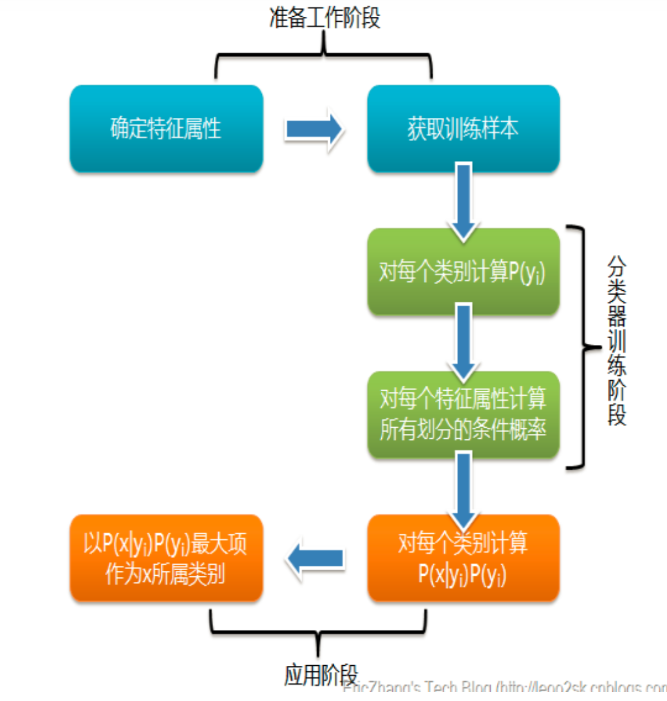
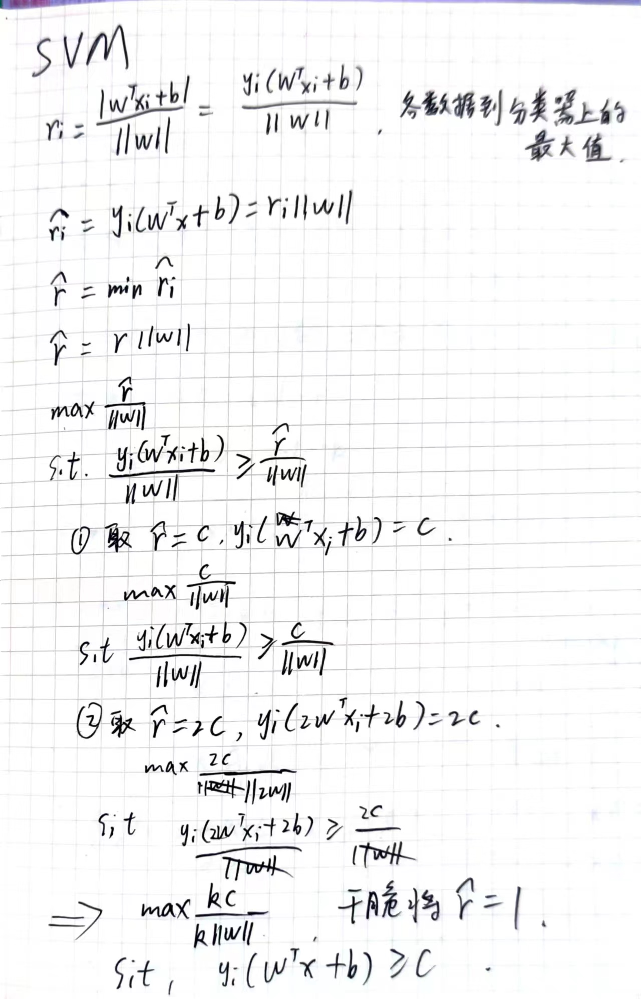
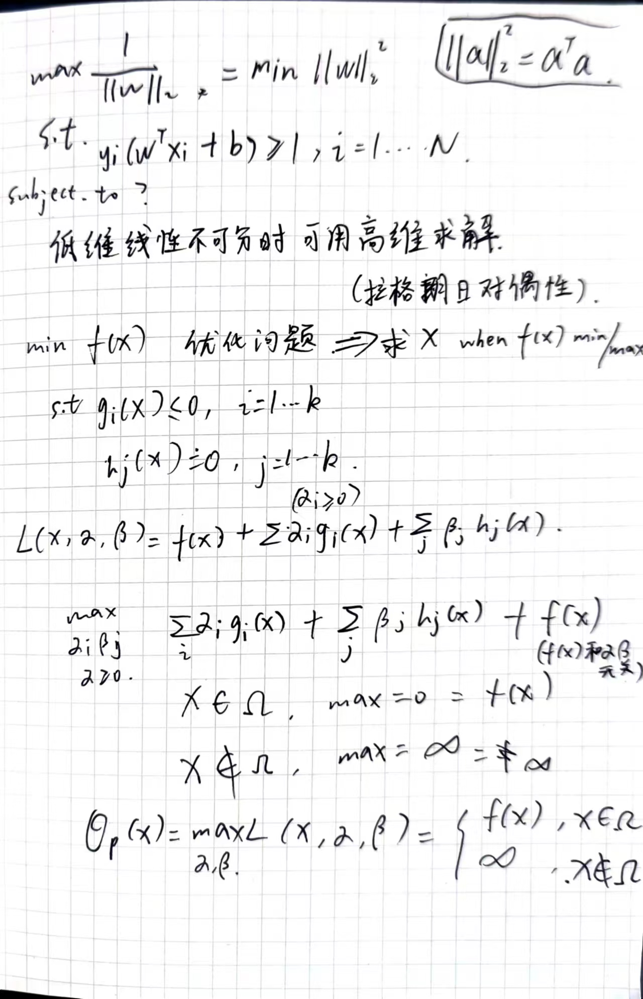

- EM优化 20分
-
-
- 最大似然估计
	- 如果第一次抽象的结果记为x1,第二次抽样的结果记为x2....那么样本结果为(x1,x2.....,x100)。这样，我们可以得到如下表达式：
	- P(样本结果|Model)
	- = P(x1,x2,…,x100|Model)
	- = P(x1|M)P(x2|M)…P(x100|M)
	- = p^70(1-p)^30.
	- p实际上是有无数多种分布
	- **让这个样本结果出现的可能性最大，也就是使得p^70(1-p)^30值最大，那么我们就可以看成是p的方程，求导即可！**
	- 那么既然事情已经发生了，为什么不让这个出现的结果的可能性最大呢？**这也就是最大似然估计的核心。**
	-
	- ## **朴素贝叶斯**
		- 为什么叫朴素？
			- 提出了两个假设
			  collapsed:: true
				- 1、特征之间独立 P(AB)=P(A)P(B)
				- 2、不会因数据的稀疏性而统计到0的情况
			- 公式书上有
			  collapsed:: true
				- 
		- https://zhuanlan.zhihu.com/p/26262151
-
-
-
- SVM
- 既然也是坐着，不如就听他讲讲做做笔记，感觉还是有些收获的。
- 提到了学校学的知识不能直接创造价值，但能提高我们如何学习知识的能力，机器学习中的数据不是关键，关键是如何通过这些数据利用算法去把某个问题的模型给建立出来，进而得到预测的结果。
- 这就好比数据是网上的学习资源，而算法思想是我们学习这个过程中的方法，通过算法训练出来的模型就是我们在学习过程中获得的能力，比方说工程能力，算法题的能力，英语能力等等，为什么可以这样类比呢？机器学习本身也是模拟我们大脑的一个学习过程，通过理解机器学习也会反过来让我们更加深刻地认识我们的学习思考过程。 #感悟
- 贝叶斯定理中提到我们对一件事物的预估是通过我们已有的经验来判断的，而不是客观事实的概率，所以只有我们尽可能地吧自身的认知和现实靠近，这样才能降低我们预估错误的概率。 #感悟
- 为什么小熊师兄的学习能力这么强，或许是因为他的算法异于常人，而不是因为数据集的差异，当然，数据集的差异也很重要，好的数据集训练出来的模型自然会更有优势。而算法本身需要的是看似枯燥的数学公式推导，这和前端学习中看似枯燥的原理学习一样，但这些硬核的东西真的是会枯燥吗？我想，在不理解她的时候我们会觉得很会晦涩难懂，但一旦领悟开窍过后会发现当中的奥妙所在，设计背后的思想总是美的。
- 课堂笔记
  collapsed:: true
	- 
	- 
-
-