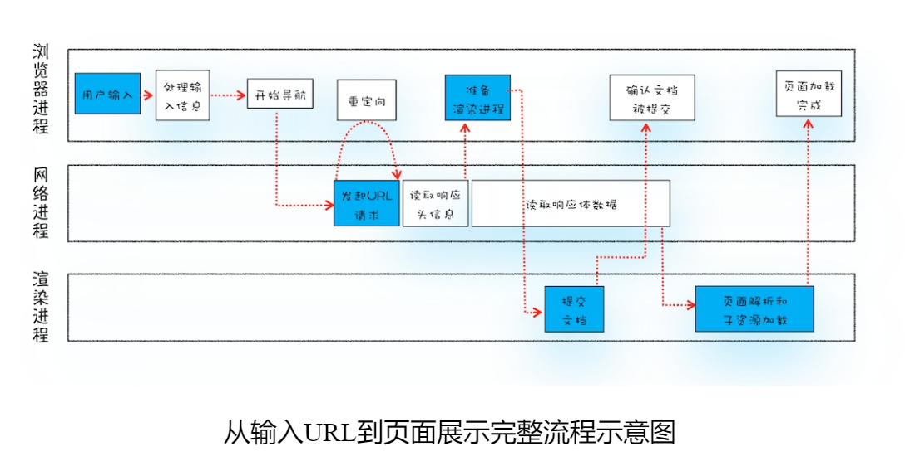

- 输入URL后，浏览器发生了什么
	- 进入加载状态，当前网页进入xxx生命周期，网络进程开始工作，与服务器建立连接，浏览器进程进入准备渲染阶段，建立连接后，渲染进程与网络进程建立信道传输数据。此时浏览器加载图标消失。
	- {:height 321, :width 610}
-
	- 1首先，浏览器进程接收到用户输入的URL请求，浏览器进程便将该URL转发给网络进程。
	- 2然后，在网络进程中发起真正的URL请求。
	- 3接着网络进程接收到了响应头数据，便解析响应头数据，并将数据转发给浏览器进程。
	- 4浏览器进程接收到网络进程的响应头数据之后，发送“提交导航(CommitNavigation)”消息到渲染进程；
	- 5渲染进程接收到“提交导航”的消息之后，便开始准备接收HTML数据，接收数据的方式是直接和网络进程建立数据管道；
	- 6最后渲染进程会向浏览器进程“确认提交”，这是告诉浏览器进程：“已经准备好接受和解析页面数据了”。
	- 7浏览器进程接收到渲染进程“提交文档”的消息之后，便开始移除之前旧的文档，然后更新浏览器进程中的页面状态。
-
-
- {:height 496, :width 640}
- 结合上图，一个完整的渲染流程大致可总结为如下：
- 1渲染进程将HTML内容转换为能够读懂的**DOM树**结构。
- 2渲染引擎将CSS样式表转化为浏览器可以理解的**styleSheets**，计算出DOM节点的样式。
- 3创建**布局树**，并计算元素的布局信息。
- 4对布局树进行分层，并生成**分层树**。
- 5为每个图层生成**绘制列表**，并将其提交到合成线程。
- 6合成线程将图层分成**图块**，并在**光栅化线程池**中将图块转换成位图。
- 7合成线程发送绘制图块命令**DrawQuad**给浏览器进程。
- 8浏览器进程根据DrawQuad消息**生成页面**，并**显示**到显示器上。
-
-
- ## this
- ### 三种方式来设置函数执行上下文中的this
	- 通过函数的call方法设置
	- 通过对象调用方法设置
	- 通过构造函数中设置
- this的设计缺陷以及应对方案
	- 嵌套函数中的this不会从外层函数中继承
		- **声明一个变量self用来保存this**，然后在bar函数中使用self
		- 使用箭头函数，箭头函数不会创建其自身的执行上下文，所以**箭头函数中的this取决于它的外部函数**
	- 普通函数中的this默认指向全局对象window
	  id:: 653b2eae-b356-4fda-8cf1-4cdc978c7a90
-
- ## Promise
- 只有then才能获取promise中的数据
- 异步函数返回的是promise
- 但异步函数中的await fetch()得到的是完整的response对象
- resolve（）用于给下一个.then()调用