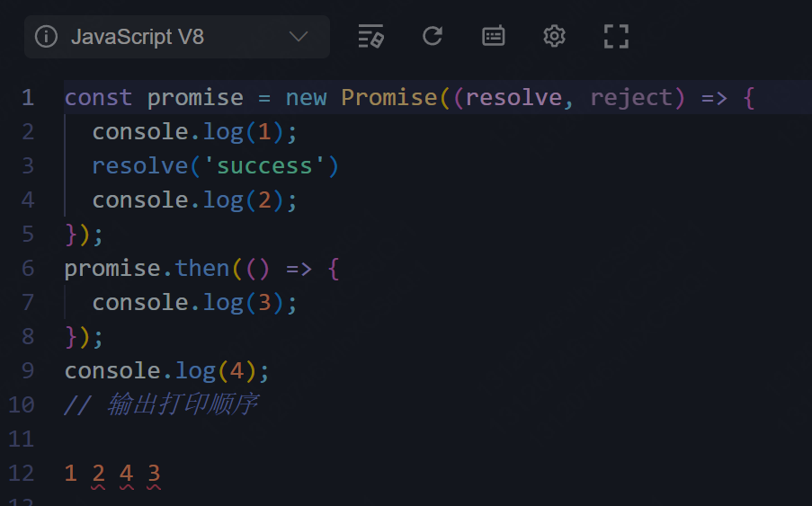
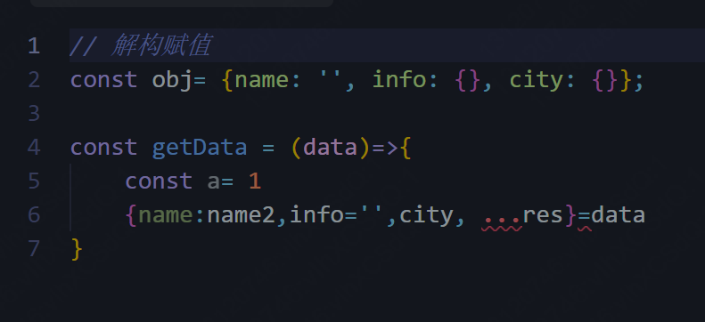

- vue的生命周期
- react的生命周期
- promise打印题
- 解构赋值
- this作用域
- 介绍一个最熟悉的知识点 原型链
- 性能优化
- vuex
- {:height 208, :width 174}
-
- {:height 100, :width 167}
- {:height 114, :width 177}
- 总结：表达有待改善，有些多余的废话，比如说问面试官有没有看过Modern JS文档。反问环节太少，