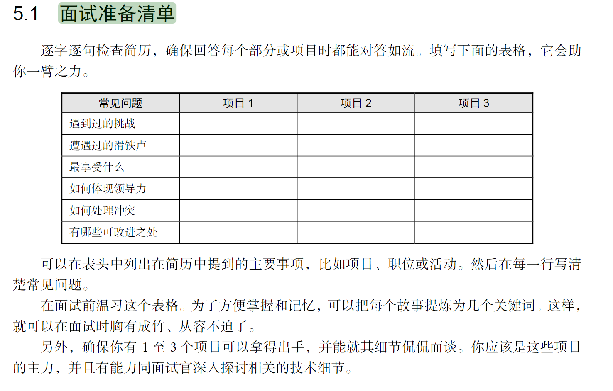
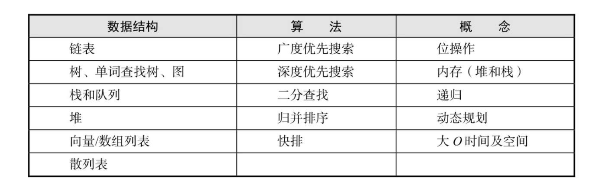

- 
-
- |常见问题|官网开发||悦假宝|博客|
  |--|--|--|--|
  |遇到过的挑战|移动端响应式布局||||
  |遭遇过的滑铁卢|字号大小调整问题，轮播图组件开发||||
  |最享受什么||||
  |如何处理冲突|看了《深入解析CSS》这本书，对CSS的布局、响应式、预处理又能更加深刻系统的理解||||
  |有哪些可改进之处||||
- 
- 自我介绍
  collapsed:: true
	- 面试官你好，我叫曾家谦，来自广州大学，专业是计算机科学与技术，大一暑假时候通过字节跳动青训营开始了解学习前端，在青训营中，在课程指导的安排下，我开始入门前端，获得了很多优质的学习资源，听了很多技术大牛的课程。对html、css、js有了更全面的认知，以及对http协议、vue、react框架等等进阶技术开始有了了解。紧接着，大二上我负责开发了一款请假打卡小程序，从0到1地设计ui，开发组件，测试调整，上线维护，熟悉了一个应用完整的开发流程是怎样的。大二的暑假加入了以伴青少年发展中心的软件部门，负责以伴官网的开发工作，在这份工作中，我接触到了Vue的实战项目，学习到了nuxt服务端渲染、css预处理器、ts、element-ui等等之前没有接触过的技术，得到了个人技术成长。希望能加入贵公司的懂车帝部门，继续深耕前端。
-
- 以伴
  collapsed:: true
	- situation（情景）
		- 我在以伴青少年发展中心实习，以伴是一家为偏远地区留守儿童提供云助学和心理辅导的公益组织，曾在今年年初位列字节跳动公益平台公益项目影响力排行榜第二名。我在以伴主要负责以伴官网的开发，官网使用的技术栈是vue的nuxt、ui使用的是element-ui和scss预处理器，语言是typescript。
	- task（任务）
		- 在项目中，我主要负责首页、关于我们以及新闻中心这几个页面的组件开发以及官网的移动端响应式布局。
	- action（行动）
		- 使用了vuex对组件进行状态管理，通过函数防抖、函数节流、Vue-Router实现图片懒加载等技术优化项目的加载效果。使用Element-Plus库实现响应式布局。使用Swiper.js库创建了志愿分享等模块的轮播图，自定义交互特效，提升了用户的浏览体验。
	- result（结果）
		- 在官网开发中，我优化了官网的响应式效果，确保官网在各种屏幕尺寸下能顺畅浏览，以及引入了vuex，更好地管理组件之间的状态。还使用了swiper.js库，实现了轮播图的效果。
	- > 深入了解vuex和节流防抖、vue-router、懒加载等等技术，了解ts的特点，实习过程中的技术成长也可以聊聊。谈谈深入解析css，还要了解一下webpack。。
-
- 悦假宝
  collapsed:: true
	- situation（情景）
		- 去年年底，我还负责开发了一款名为悦假宝的请假打卡小程序，这款小程序的开发背景是基于疫情期间，辅导员在节假日需要审批学生大量的返校离校工作，而以往在企业微信上的审批流程过于繁琐，以及学生在疫情期间每天都需要在企业微信上健康上报，使用体验不是很好。于是我和团队为学校开发了一款专门用于假期审批和学生健康上报的小程序，服务对象是学生、辅导员以及学生处。
		- task（任务）
			- 负责小程序核心功能开发，包括封装了辅导员审批、学生健康上报、学生请假申请等组件。后端利用微信的云开发进行开发，代码使用github来保存，代码版本控制使用的是git。负责编写项目的设计文档。
		- action（行动）
			- 利用微信云开发的数据库来安全地保存用户数据；期间还编写了云函数脚本，处理了数据库中3600多条用户字段的更新；以及使用echart.js对学生的健康上报情况可视化地呈现给辅导员端；以及对学生、辅导员、学生处三端进行了权限设计，方便不同用户的使用
		- result（结果）
			- 这次的小程序开发，让我收获了从0到1开发应用经验，全面地了解一款应用系统该如何设计，让我有了使用git和github的团队开发经验，熟悉了代码共享和版本控制的流程。以及让我学会了如何编写一个项目的设计开发文档。通过这款小程序，我和团队也获得了传智杯前端应用挑战赛的区域赛三等奖，激励了我继续在前端开发这个方向继续深耕。
-
- 博客搭建
	- situation（情景）
		- 平时喜欢逛掘金和一些个人技术博客网站，当有了一两次项目开发经验后，决定自己也写一个博客，用来记录个人的技术成长。一开始使用的是Gatsby这个博客框架来搭建，但感觉gatsby的语法比较偏向restful的风格，用起来不太习惯，于是改用了react的next进行搭建，ui使用的是tailwind。
	- task（任务）
		- 主要是博客列表和关于我的页面的搭建。
	- action（行动）
		- 使用了grey-matter来解析md文件前面的标题，子标题，日期并自定义了分隔符的设置；使用了antd的list组件来显示文章列表，利用pagination组件实现了分页的功能。使用vercel来部署博客
	- result（结果）
		- 搭建起了博客的基本内容，希望能养成输出技术博客的习惯，记录个人的技术成长之路。通过费曼学习法，巩固加深已学知识。
	-